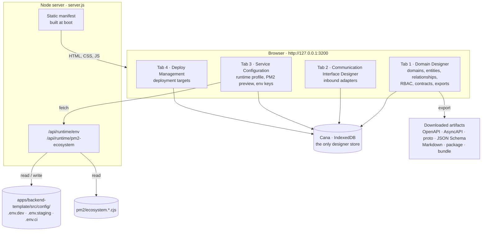
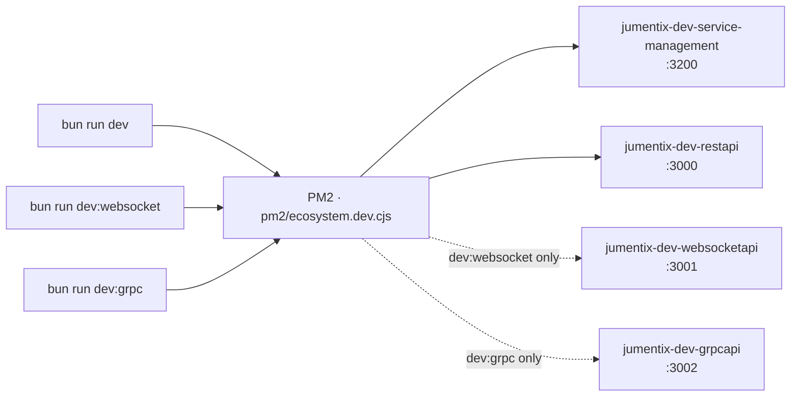
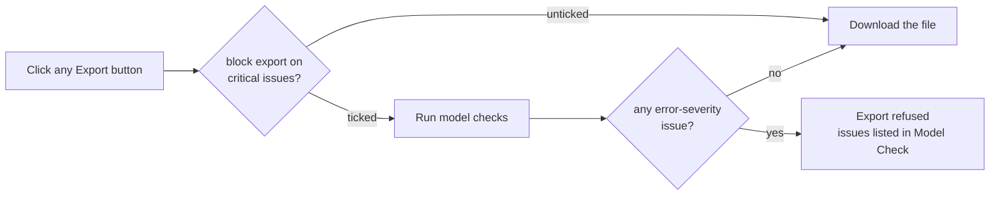
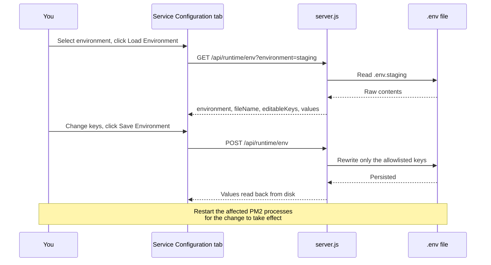
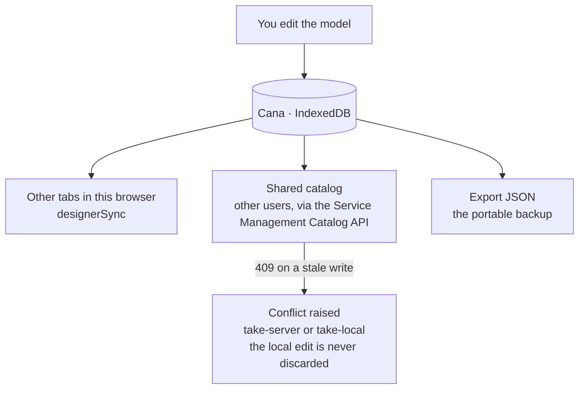
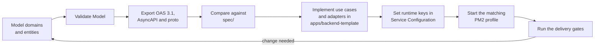

# Using the Service Manager and the Domain Designer

This guide takes you from a clean checkout to a modelled domain exported as
contracts, and then to a running service. It is task-ordered: install, run,
model, validate, export, configure the runtime, register deploy targets, and
recover when something breaks.

It is the entry point to the Service Management documentation chain. Each
section links to the reference document that owns the subject in depth.

## 1. What the Service Manager is

The Service Manager is a local, zero-build browser application served over
plain Node HTTP. It is the design surface of the monorepo: you model domains,
declare communication interfaces, configure the runtime profile, and register
deployment targets.

Nothing in it is a mock. Its exports are real artifacts you feed into
`apps/backend-template/`, and the Service Configuration tab writes directly to
the environment files the backend boots from.



Implementation:

| Path | Responsibility |
| --- | --- |
| `apps/service-management/index.html` | Tab shell, panels, import map |
| `apps/service-management/script.js` | Designer wiring and event handlers |
| `apps/service-management/src/` | Store, sync, UI and PWA modules |
| `apps/service-management/server.js` | Static server plus the runtime APIs |
| `packages/designer-core/` | DOM-free model, validation, exporters, importers |
| `packages/cana/` | IndexedDB adapter used as the designer store |

## 2. Prerequisites

- Bun `>=1.3.13` (the repository pins `bun@1.3.13`)
- Node.js `>=22.0.0 <23.0.0`
- PM2, installed as a workspace dependency
- `rtk` for repository command execution
- A Chromium-based or Firefox browser with IndexedDB enabled

Install the workspace dependencies once:

```bash
rtk proxy bun install
```

## 3. Vendored browser bundles

The application is a zero-build SPA that resolves two bare specifiers through
the import map in `index.html`: `@jumentix/cana` and `@jumentix/designer-core/`.
Both targets live under `apps/service-management/vendor/`, are gitignored, and
are generated locally.

The dev entry points generate them for you — `dev:service-management` and the
`pm2:start:dev:*` scripts run the vendor step before starting the process, so a
fresh clone boots a working designer with no extra command.

Generate them by hand when you start the server directly, without PM2:

```bash
rtk proxy bun run service-management:vendor
```

That single script writes the Cana browser bundle to
`apps/service-management/vendor/cana/index.js` and mirrors
`packages/designer-core/src` into
`apps/service-management/vendor/designer-core/`.

Without the bundles the page loads, the shell renders, and every panel stays
inert because the module graph never resolves, with repeated `/vendor/...` 404s
in the browser console. The browser integration suites generate them before
booting the server, so a stale bundle can never read as a designer outage in
CI.

## 4. Running the application

### 4.1 Start it alone

```bash
rtk proxy bun run dev:service-management
```

This starts the PM2 process `jumentix-dev-service-management` with the Bun
interpreter. Open:

```text
http://127.0.0.1:3200
```

### 4.2 Start it with the backend

```bash
rtk proxy bun run dev
```

`dev` maps to `pm2:start:dev:restapi`, which starts
`jumentix-dev-service-management` and `jumentix-dev-restapi` from
`pm2/ecosystem.dev.cjs`. Use the realtime variants when you also need a
WebSocket or gRPC process:

```bash
rtk proxy bun run dev:websocket
```

```bash
rtk proxy bun run dev:grpc
```



### 4.3 Run it without PM2

```bash
NODE_ENV=dev bun apps/service-management/server.js
```

### 4.4 Environment variables

Every variable below is prefixed `JUMENTIX_SERVICE_MANAGEMENT_`, except
`NODE_ENV`.

| Variable | Default | Purpose |
| --- | --- | --- |
| `…_PORT` | `3200` | HTTP port |
| `…_HOST` | `127.0.0.1` | Bind address |
| `…_CONFIG_DIR` | `apps/backend-template/src/config` | Where the runtime env API reads and writes |
| `…_PM2_DIR` | `pm2/` | Where the PM2 ecosystem preview reads |
| `…_AUTH_TOKEN` | unset | Requires `Authorization: Bearer <token>` on the env `POST` |
| `…_STATIC_MANIFEST_REFRESH` | from `NODE_ENV` | `on-miss` re-scans the static manifest; `boot-only` never does |
| `NODE_ENV` | `dev` | Fallback environment when a request names none |

The server **fails closed at boot** when the configured directory does not
exist: it prints `Service Management config directory not found: <path>` on
stderr and exits with code `1`. Serving defaults for a missing directory would
be a contract violation, so it refuses to start instead.

Ports per PM2 profile:

| Ecosystem | Process | Port |
| --- | --- | --- |
| `pm2/ecosystem.dev.cjs` | `jumentix-dev-service-management` | `3200` |
| `pm2/ecosystem.staging.cjs` | `jumentix-staging-service-management` | `4200` |
| `pm2/ecosystem.production.cjs` | `jumentix-prod-service-management` | `5200` |

### 4.5 Process control

```bash
rtk proxy bun run pm2:list
```

```bash
rtk proxy bun run pm2:logs
```

To restart only this application after editing its source:

```bash
pm2 restart jumentix-dev-service-management
```

## 5. First run

On a fresh browser profile the designer boots to an **empty model**. Every tab
shows a guided empty state naming that tab's first action — there is no silent
pre-populated template.


The Domain Designer's first action is **Load Sample Model** (also available in
the Export panel). One click loads a realistic identity domain — `Users`,
`Organization`, `Email`, `Phone` and `ContactPoint`, the same resources
`spec/1.0.0.yml` declares — with relationships, per-entity RBAC, a message
contract, invariants and OpenAPI `oneOf` + discriminator composition.


Sample content stays distinguishable from your own work: every sample id
carries a `sample-` prefix and sample domains show a `sample` badge in the
domain list. Loading it over an existing model asks for confirmation, and undo
restores the previous model. Deleting it is ordinary domain deletion.

A complete first round trip:

1. Click `Load Sample Model`.
2. Click `Validate Model` and read the Model Check panel.
3. Click `Export OAS 3.1` — the browser downloads
   `domain-designer-oas-3.1.json`.
4. Delete the sample domain and model your own.

## 6. Domain Designer

### 6.1 Canvas and navigation

| Control | Effect |
| --- | --- |
| `Ctrl/Cmd + mouse wheel`, `-` / `+` | Zoom |
| `Space + drag` | Pan the canvas |
| `Fit` | Frame the whole model |
| `Reset View` | Restore the default viewport |
| `Snap: On` | Toggle snap-to-grid |
| `Compact View` | Collapse entity cards to their headers |
| `Large Canvas: Off` | Toggle the high-density performance mode |
| `Auto Layout` | Reflow domains and entities |
| `Curved` / `Orthogonal` | Relationship routing style |
| Mini-map | Move the viewport to a domain in one click |

Keyboard shortcuts. All of them stand down while the focus is inside an
`input`, `textarea` or `select`:

| Shortcut | Action |
| --- | --- |
| `Ctrl/Cmd + Z` | Undo |
| `Ctrl/Cmd + Shift + Z`, `Ctrl/Cmd + Y` | Redo |
| `Arrow keys` | Nudge the selected entity by 8px |
| `Shift + Arrow keys` | Nudge by 16px |
| `Delete` / `Backspace` | Delete the selected relationship, or the selected entity after a confirmation |
| `Alt + L` | Auto layout |
| `Alt + R` | Start a relationship from the selected entity |
| `Alt + V` | Toggle compact view |
| `Escape` | Cancel pick mode, cancel an anchor drag, clear the relationship selection |

Every outcome — success, refusal and reason — is announced in the status region
under the tab bar, which is also a screen-reader live region. When an action
appears to do nothing, read that line first.

### 6.2 Domains and bounded context

Create, rename, delete and colour domains from the **Domains** panel. With a
domain selected, the **Bounded Context** panel captures the strategic metadata:
ubiquitous language, owner team, upstream and downstream dependencies,
integration channel, package dependencies and shared value objects. Click
`Save Context` to persist, `Clear` to reset.

This metadata travels with the JSON, Markdown and domain-package exports.

### 6.3 Entities, fields and templates

With an entity selected, the Entity Inspector offers `Save Name`,
`Move Domain`, `Duplicate`, `Delete`, and `Save Rules` for the aggregate-root
flag and the invariants (one rule per line). Aggregate roots show an `AR`
marker on their card.


Fields carry OpenAPI-aligned metadata:

| Attribute | Values |
| --- | --- |
| `type` | `string`, `integer`, `number`, `boolean`, `array`, `object`, `date`, `datetime`, `uuid` |
| `format` | `uuid`, `date`, `date-time`, `email`, `uri` |
| Flags | `required`, `PK`, `FK`, `unique`, `nullable` |
| `enum` | Comma-separated allowed values |
| Extended metadata | `description`, `pattern`, `minLength`, `maxLength`, `minimum`, `maximum`, `itemsType`, through the `meta` button on the field row |

Field templates add a fixed set of fields, skipping any name already taken:

| Template | Fields added |
| --- | --- |
| `tenantRef` | `organizationId` (uuid, required, FK) |
| `auditTrail` | `createdBy`, `updatedBy` (uuid, required, FK) |
| `softDelete` | `isDeleted` (boolean, required), `deletedAt` (datetime, nullable) |
| `contactPack` | `emails`, `phones` (array of string) |

Entity templates reshape the whole entity: `crudAggregate`, `eventSourced`,
`referenceData` and `tenantOwned`.

The inspector also renders an **API preview (OpenAPI CRUD)** — the five routes
the exporter will emit for the entity, so you see the contract before exporting
it.

### 6.4 Relationships

Three ways to create one:

- select source and target in the **Relationship** panel and click `Connect`;
- click `Pick On Canvas` and click the two entities;
- drag from an edge anchor (`top`, `right`, `bottom`, `left`) onto another
  entity.

Leave `auto FK` ticked to generate the foreign key on the target side.

With a relationship selected you can tune cardinality (`1` or `N` per side),
label offset (`x`, `y`, plus `Reset Label Pos`), bend path (`bendX`, `bendY`),
anchor behaviour (`auto` or `center`) and routing style. Click
`Save Relationship` to apply, `Reverse` to flip direction.

Two guards apply on creation: source and target must be different entities, and
a relationship between the same pair cannot be duplicated.

### 6.5 RBAC, message contracts and OpenAPI composition

For each entity and action (`list`, `getById`, `create`, `update`, `delete`),
toggle `superadmin`, `admin` and `user`, then click `Save RBAC Rule`. Tenant
scope is **derived from the roles**, not set by hand: `admin` and `user` scope to
their organization, `superadmin` is global, which is what the runtime enforces.
Legacy direct scopes still run but are not editable here.


Declare `event`, `command`, `request` and `response` contracts per entity with a
name, channel or topic, version, and a JSON payload schema. `Add Contract`
registers one; the `payload` button on a listed contract edits its schema.
Invalid JSON is refused with an explicit message.

Per entity, choose an OpenAPI composition mode (`oneOf`, `allOf`, `anyOf`), list
schema refs, add external `$ref` targets and set a discriminator property, then
`Save OAS Composition`.

Where these land in the exported documents — and the exact fidelity guarantees
of each crossing — is owned by
[Contract Parity Guarantees](/docs/jumentix/reference/service-management-contract-parity).

### 6.6 Validation, the export gate and schema diff

`Validate Model` runs the model checks. Each issue carries a severity (`error`,
`warn`, `info`) and is prefixed accordingly. The minimum-severity selector
filters the list.


Tick **block export on critical issues** to turn validation into a hard gate.
Every export path calls the gate first and refuses while any `error`-severity
issue exists.



For change control, `Save Baseline` snapshots the current schema and `Run Diff`
compares the model against it, reporting created and dropped domains, entities,
fields, relationships and message contracts, and flagging type and
required-flag changes as migration hints. `Clear Baseline` removes the
snapshot.

### 6.7 Generation, export and import

`Code Preview` renders skeletons for the domain model, repository port, use
case, controller and handler. `Generate Examples` renders request and response
payload examples. Select an entity to scope the output, or leave nothing
selected for the whole canvas.


| Button | Downloaded file | Use |
| --- | --- | --- |
| `Export JSON` | `domain-designer.json` | Full model backup, re-importable |
| `Export OAS 3.1` | `domain-designer-oas-3.1.json` | REST contract |
| `Export Markdown` | `domain-designer-model.md` | Human-readable model documentation |
| `Export JSON Schema` | `domain-designer-json-schema.json` | Validation schemas |
| `Export AsyncAPI` | one `<version>.<transport>.yml` per transport | Event and message contracts |
| `Export Proto` | `async-api.proto` | gRPC service definition |
| `Export Boilerplate Bundle` | `domain-designer-boilerplate-bundle.json` | Scaffolding input for the backend template |
| `Export Package` | `<domain>-package.json` | One domain, shareable and re-importable |

Package export uses the selected domain as the source, so select a domain
first. Import targets are `Import JSON`, `Import OAS 3.1` and
`Import Package`; each failure reason maps to one explicit status message.

Domain-package versioning, dependency graphs and conflict policy are owned by
[Collaboration and Packaging](/docs/jumentix/reference/service-management-collaboration-packaging).

## 7. Communication Interface Designer

Register the inbound adapters that will serve the modelled operations.


The candidate is validated **before** it touches state, and a refusal explains
itself in the status region:

| Field | Rule |
| --- | --- |
| Interface Type | `HTTP/REST`, `gRPC`, `WebSocket`, `SSE Server` |
| Framework/Runtime | Follows the interface type, drawn from the canonical runtime matrix. WebSocket offers `socket-io`; gRPC offers `grpc`; HTTP/REST and SSE offer the eleven HTTP frameworks, in canonical spelling (`derby-js`, `sails-js`) |
| Entrypoint | A TypeScript/JavaScript path **under `src/interface/`**, for example `src/interface/HTTP/adapters/start-rest-api.ts` |
| Controller mapping | The shape `XController.action`, for example `UsersController.create` |

Duplicates are detected and refused. Type and framework stay selected after a
successful add, so registering several adapters of the same kind does not
re-pick them each time.

## 8. Service Configuration


### 8.1 Runtime profile

| Control | Values |
| --- | --- |
| Service Kind | `REST API`, `WebSocket API + REST API`, `gRPC API + REST API` |
| Run Mode | Dedicated Server (SSH), Virtual Machine (SSH), Container, Functions |
| Cloud Provider | AWS, Google Cloud, Azure, Vercel, Cloudflare, Docker, Self Hosted |
| Static assets path | Optional, for example `public/` |
| Ports | REST, WebSocket, gRPC |

`Save Profile` validates before it writes: ports outside range, ports colliding
across the protocols the selected service kind actually binds, and run-mode ×
provider combinations with no deploy target in the Requirement `059` matrix are
refused with the reason on the status surface.

### 8.2 PM2 ecosystem preview

The preview reads the real `pm2/ecosystem.*.cjs` files through
`GET /api/runtime/pm2-ecosystem`, so adding an app to an ecosystem file changes
the preview with no code change, and no package-manager invocation is embedded
anywhere. `ci`/`test` map to a file that does not exist in the repository; the
endpoint reports that as an explicit `exists: false` state rather than an error
or a silently empty list.

### 8.3 Runtime environment variables

The editor exposes runtime keys in two tiers. The write allowlist is a security
decision, pinned by Requirement `126`:

| Tier | Keys |
| --- | --- |
| Editable | `JUMENTIX_HTTP_FRAMEWORK`, `JUMENTIX_REALTIME_API`, `JUMENTIX_REALTIME_API_PROTOCOL`, `JUMENTIX_REALTIME_API_DATABASE_DRIVER`, `JUMENTIX_DATABASE_DRIVER`, `JUMENTIX_KEYVALUESTORAGE_DRIVER`, `JUMENTIX_MESSAGE_MEDIATOR_ADAPTER`, `JUMENTIX_WEBSOCKET_SOCKETIO_ADAPTER`, `JUMENTIX_WEBSOCKET_REDIS_URL` |
| Read-only | Connection endpoints and non-secret configuration such as `JUMENTIX_DATABASE_NAME`, `JUMENTIX_REDIS_HOST`, `JUMENTIX_RABBITMQ_EXCHANGE`, `JUMENTIX_CORS_ALLOWED_ORIGINS` |
| Never exposed | Credential-bearing keys such as `JUMENTIX_JWT_TOKEN_SECRET_KEY`, `JUMENTIX_REDIS_PASSWORD`, `JUMENTIX_RABBITMQ_URL` — enforced by omission from both allowlists |

Each editable key is constrained to a canonical enum, so the editor cannot
write a value the backend would reject at bootstrap.

Pick the environment, click `Load Environment`, change what you need, then
click `Save Environment`. The panel names the exact file it is editing.



Environment names map to files:

| Selected environment | File |
| --- | --- |
| `dev`, `development` | `.env.dev` |
| `staging` | `.env.staging` |
| `ci`, `test` | `.env.ci` |

Any other value is refused with HTTP 400 naming the accepted set.

### 8.4 Driving the APIs directly

```bash
curl "http://127.0.0.1:3200/api/runtime/env?environment=dev"
```

```bash
curl "http://127.0.0.1:3200/api/runtime/pm2-ecosystem?environment=dev"
```

```bash
curl -X POST http://127.0.0.1:3200/api/runtime/env \
  -H 'content-type: application/json' \
  -d '{"environment":"dev","values":{"JUMENTIX_HTTP_FRAMEWORK":"fastify"}}'
```

When `JUMENTIX_SERVICE_MANAGEMENT_AUTH_TOKEN` is set, the `POST` requires
`Authorization: Bearer <token>` and answers 401 without it. Reads are not
gated by the token.

Failure envelopes are distinct on purpose: a malformed body or a rejected value
is HTTP 400 with `error` and `details`; an unsupported environment is HTTP 400
naming the accepted values; a filesystem failure is HTTP 500 with `error`,
`code`, `path` and `details`. A broken ecosystem file reports separately as
`PM2 ecosystem file operation failed.`

Every mutation is logged server-side with the timestamp, the environment and
the changed key names.

The env-file semantics, the enum sets and the fixed paths are owned by
[Runtime Environment Contracts](/docs/jumentix/reference/service-management-runtime-environment).

## 9. Deploy Management

Register deployment targets with a name, target type, service type, region and
runtime version. PM2-managed targets also take a PM2 profile.


The form validates against the Requirement `059` deploy matrix and explains
every refusal:

| Target type | Service types it can run | PM2 profile | Region means |
| --- | --- | --- | --- |
| `dedicated-server`, `vm`, `ec2` | `restapi`, `websocket+restapi`, `grpc+restapi` | Required (`dev`, `staging`, `production`) | SSH host or instance address |
| `lambda`, `vercel-functions`, `cloudflare-workers` | `functions` | Not applicable | Provider region |

The runtime/version field wants a name plus a version, such as `nodejs22.x` —
a bare runtime name is refused. Targets can be edited in place and duplicated;
`Cancel` leaves an edit without applying it.

The matrix, the metadata contract and the lifecycle rules are owned by
[Operations Console](/docs/jumentix/reference/service-management-operations-console).

## 10. Where your work is stored

Cana (IndexedDB) is the **sole** designer store. There is no localStorage
fallback and no driver switch: no environment variable and no URL parameter can
route the designer to another store. A host that cannot resolve the Cana bundle
gets a store whose operations report `unavailable` — an explicit terminal state
the boot surfaces, never a silent fallback.



Three consequences worth knowing before you rely on it:

- **Durability is reported, not assumed.** When the browser has not granted
  persistent storage, the status region says so: storage works, but the browser
  may reclaim it under pressure.
- **Multi-tab edits converge.** A second tab of the same browser sees your
  changes through the committed-event stream; remote applies are not undoable
  and never import selection.
- **Clearing site data deletes the model.** The PWA "Reset app shell" action
  touches only the `service-management-shell@*` caches and never the designer
  data — but the browser's own "clear site data" removes both.

Export a JSON model before any risky change: that file is the only portable
backup.

Storage states, the one-way migration and the offline matrix are owned by
[Cana Adoption, Migration and Offline Behaviour](/docs/jumentix/reference/service-management-cana-adoption).
The install, update and recovery flows are owned by
[Design System and PWA Shell](/docs/jumentix/reference/service-management-design-system-pwa).

## 11. From the model to a running service



1. Model the domains and entities.
2. Run `Validate Model` and resolve every error.
3. Export OpenAPI 3.1 and, for event-driven services, AsyncAPI and the proto.
4. Compare the output against the canonical specifications in `spec/`.
5. Implement the use cases and adapters in `apps/backend-template/`.
6. Set the runtime keys in Service Configuration.
7. Start the matching PM2 profile and run the delivery gates.
8. Save a schema baseline before the next modelling round, so the following
   diff produces migration hints.

## 12. Troubleshooting

### The page loads but every panel is inert

The vendored bundles are missing. Run `bun run service-management:vendor`, then
reload. The dev entry points do this for you; starting `server.js` directly does
not. The browser console shows repeated 404s for `/vendor/...` in this
state.

### The server exits immediately

It fails closed when the config directory does not exist, printing
`Service Management config directory not found: <path>`. Either run it from the
repository root, or point `JUMENTIX_SERVICE_MANAGEMENT_CONFIG_DIR` at a
directory that exists.

### Port already in use

```bash
lsof -ti tcp:3200 | xargs kill
```

```bash
JUMENTIX_SERVICE_MANAGEMENT_PORT=3300 bun apps/service-management/server.js
```

Changing the port changes the browser origin, and IndexedDB is scoped per
origin — a model saved on `127.0.0.1:3200` is not visible on port `3300`.

### A new asset returns 404

The static manifest is built once at boot, deliberately: serving from a
pre-built allowlist bounds the servable surface. In development the manifest
re-scans **on a miss**; in any other mode it does not. Set
`JUMENTIX_SERVICE_MANAGEMENT_STATIC_MANIFEST_REFRESH=on-miss` to opt in, or
restart the process.

### An action appears to do nothing

Read the status region under the tab bar. Adapter, service-profile and
deploy-target forms validate before touching state and explain each refusal
there.

### An export does nothing

The export quality gate is on. Untick **block export on critical issues**, or
run `Validate Model` and resolve every `ERROR` entry.

### `Delete`, the arrow keys or `Space + drag` do nothing

The keyboard handlers stand down while focus is inside an `input`, `textarea`
or `select`. Click empty canvas first.

### `Load Environment` or `Save Environment` fails

Check the response envelope. A 400 names an unsupported environment or a
rejected value; a 500 carries `code` and `path` for the filesystem failure. A
401 means `JUMENTIX_SERVICE_MANAGEMENT_AUTH_TOKEN` is set and the request
carried no matching bearer token.

### A saved runtime key has no effect

Environment files are read at process start. Restart the affected PM2 process:

```bash
pm2 restart jumentix-dev-restapi
```

### The model disappeared

IndexedDB is scoped per origin and is removed by "clear site data". Restore
with `Import JSON` from an exported backup. If the status region reports
degraded durability, the browser may have reclaimed the storage.

## 13. Verify your setup

```bash
rtk proxy bun run test:integration:service-management
```

The suite covers the static server and manifest, the runtime env API and its
contract, the PM2 ecosystem endpoint, first run, SPA boot, the Cana migration,
multi-tab sync, the offline persistence matrix, the PWA shell, interface
adapters, the deploy-target lifecycle and catalog sync.

## References

- [Runtime Environment Contracts](/docs/jumentix/reference/service-management-runtime-environment)
- [Domain Designer Features and Usage](/docs/jumentix/reference/domain-designer-features)
- [Module Architecture and the IDesignerStore Port](/docs/jumentix/reference/service-management-module-architecture)
- [Contract Parity Guarantees](/docs/jumentix/reference/service-management-contract-parity)
- [Operations Console](/docs/jumentix/reference/service-management-operations-console)
- [Cana Adoption, Migration and Offline Behaviour](/docs/jumentix/reference/service-management-cana-adoption)
- [Design System and PWA Shell](/docs/jumentix/reference/service-management-design-system-pwa)
- [Collaboration and Packaging](/docs/jumentix/reference/service-management-collaboration-packaging)
- [Creating SPA/PWA with Jumentix](/docs/jumentix/guides/spa-pwa)
- [Creating a REST API with Jumentix](/docs/jumentix/guides/rest-api)
