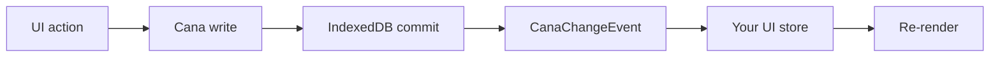

# Integrate Cana with any UI framework

`@jumentix/cana` is a browser persistence client. It does not own rendering
state. Every UI framework — or no framework — follows the same contract.

## Stable contract

```ts
import { createClient, isCanaErrorCode, type CanaChangeEvent } from '@jumentix/cana';

const client = createClient({
  name: 'tasks-app',
  schema: {/* versioned stores */},
  originId: 'ui-main'
});

await client.open();

// Writes
await client.table('tasks').add({/* record */});
await client.transaction('readwrite', ['categories', 'tasks'], async (tx) => {
  // Only Cana/IndexedDB awaits inside this callback
});

// Reads after commit
client.subscribe((event: CanaChangeEvent) => {
  // Patch your UI store from committed events
});
```

That is the whole integration surface:

| Step       | Cana API                                           | Your job                              |
| ---------- | -------------------------------------------------- | ------------------------------------- |
| 1. Create  | `createClient({ name, schema, originId? })`        | Pick DB name and schema once          |
| 2. Open    | `await client.open()`                              | Call before any table access          |
| 3. Write   | `table().add/put/update/delete` or `transaction()` | Call from UI actions                  |
| 4. Commit  | IndexedDB `oncomplete`                             | Cana buffers events until commit      |
| 5. Sync UI | `client.subscribe(...)`                            | Map `CanaChangeEvent` into your store |



## Rules that never change between frameworks

1. **Never `await` non-IndexedDB work inside a transaction.** `await fetch(...)`,
   timers, or unrelated promises end the transaction. Cana reports
   `TransactionInactive`.
2. **Writes have three outcomes:** `committed | rolled-back | unknown`. Enable
   `operationLedger: true` and use `resolveWrite()` when you must settle
   `unknown` after a crash.
3. **Errors are plain data.** Use `isCanaError()` / `isCanaErrorCode()` — not
   `instanceof`.
4. **`originId` filters your own echo** when you also apply optimistic UI
   patches before the commit event arrives.
5. **`sinceCursor` resumes listeners after reload.** If replay fails with
   `NotFound`, reload tables then resubscribe.

## Manual wiring vs helper packages

| Situation                                           | Use                                                                                                                                              |
| --------------------------------------------------- | ------------------------------------------------------------------------------------------------------------------------------------------------ |
| Vanilla JS/TS, Svelte, Solid, Angular, custom store | Manual `subscribe` → patch state (this guide + [Vanilla TypeScript](/docs/jumentix/packages/cana/vanilla-typescript))                                                    |
| React with Context                                  | Optional [`@jumentix/cana-react`](/docs/jumentix/packages/cana-react) or manual Context ([tutorial](/docs/jumentix/packages/cana/react-context)) |
| React with Redux                                    | Optional `connectCanaToRedux` from `@jumentix/cana-react/redux` ([tutorial](/docs/jumentix/packages/cana/react-redux))                           |
| Vue 3 with Pinia                                    | Optional [`@jumentix/cana-vue`](/docs/jumentix/packages/cana-vue) ([tutorial](/docs/jumentix/packages/cana/vue-pinia))                           |

Helper packages only translate committed events into framework state. They do
not replace `createClient`, schema design, or transaction discipline.

## Minimal subscribe adapter

Copy this pattern into any store. Replace `applyEvent` with your framework's
update API (`setState`, `dispatch`, `store.$patch`, a `Map`, etc.).

```ts
import type { CanaChangeEvent, CanaClient } from '@jumentix/cana';

export function connectCanaToUi(
  client: CanaClient,
  applyEvent: (event: CanaChangeEvent) => void
): () => void {
  return client.subscribe((event) => {
    if (event.originId === client.originId) {
      // Optional: skip if you already applied an optimistic patch
    }
    applyEvent(event);
  });
}
```

Map event kinds consistently:

| `event.type`          | Typical UI patch                        |
| --------------------- | --------------------------------------- |
| `created` / `updated` | Upsert record by key                    |
| `deleted`             | Remove record by key                    |
| `cleared`             | Empty that store's in-memory collection |

## Checklist for a new framework

- [ ] `open()` runs once at app boot (or route enter) before table calls.
- [ ] UI actions write through Cana; they do not mutate durable state alone.
- [ ] A single subscriber (or helper) patches UI state from committed events.
- [ ] Multi-store writes use `transaction('readwrite', [...], ...)`.
- [ ] Unsubscribe on tear-down (component unmount, route leave, app dispose).
- [ ] Replay/reload path exists for `sinceCursor` failures.

## Next

- [Vanilla TypeScript tutorial](/docs/jumentix/packages/cana/vanilla-typescript) — full task app with no framework.
- [Getting started](/docs/jumentix/packages/cana/usage/getting-started) — schema and first writes.
- [Transactions and change events](/docs/jumentix/packages/cana/usage/transactions-events) — atomic writes and replay.
