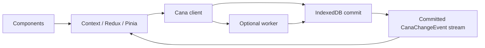
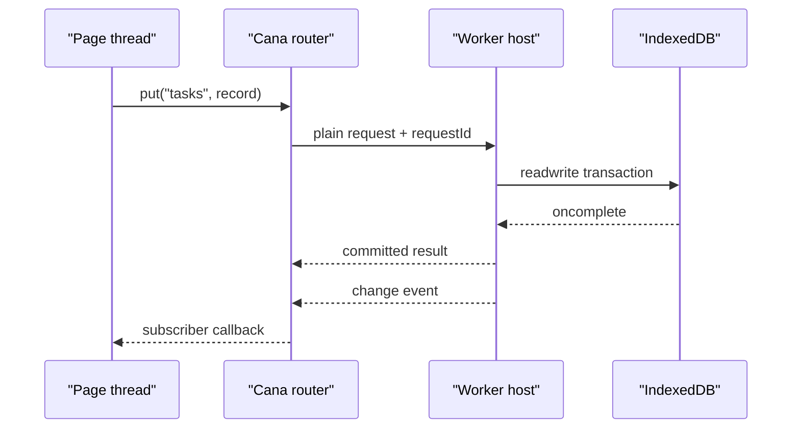
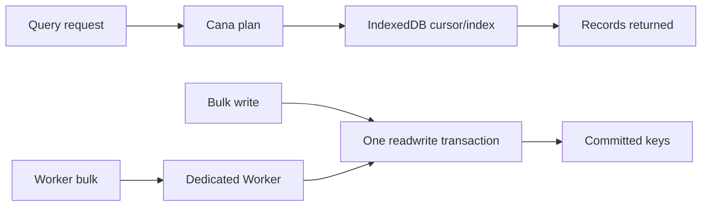

# @jumentix/cana

IndexedDB offline database adapter for Jumentix applications.

<figure className="cana-brand-scene">
  
  <figcaption>
    Cana keeps durable browser data close to the application: sugarcane as fuel,
    Jumentix fully charged, and persistence work kept off the UI path.
  </figcaption>
</figure>

```ts
import { createClient } from '@jumentix/cana';

const client = createClient({
  name: 'tasks-app',
  schema: {
    version: 1,
    stores: [
      { name: 'categories', keyPath: 'id', indexes: [{ name: 'byName', keyPath: 'name' }] },
      {
        name: 'tasks',
        keyPath: 'id',
        indexes: [
          { name: 'byCategory', keyPath: 'categoryId' },
          { name: 'byUpdatedAt', keyPath: 'updatedAt' }
        ]
      }
    ]
  }
});

await client.open();
await client.table('categories').put({ id: 'work', name: 'Work' });
await client.table('tasks').add({
  id: 'task-1',
  title: 'Write the Cana tutorial',
  categoryId: 'work',
  completed: false,
  updatedAt: Date.now()
});
```

## Responsibility in context

- **Stack layer:** offline / browser persistence adapter
- **Owns:** IndexedDB client API for PWAs
- **Used with:** `@jumentix/cana-react`, `@jumentix/cana-vue`, designer-core, SPA/PWA guide, service-management
- **Not responsible for:** server databases, Redis KV, REST/WebSocket protocols

## Three things to know before using it

**IndexedDB is the durable browser database.** Cana keeps the public API close
to IndexedDB semantics: explicit `open()`, stable schema versions, indexed
tables, atomic transactions and committed change events. If you need storage
diagnostics, use `storageState()` and `durabilityAssessment()` after the client
opens.

**Writes have three outcomes, not two.** `committed | rolled-back | unknown`.
The third covers a transaction torn down without either event firing — a killed
worker, a closed tab. Enable `operationLedger: true` and `resolveWrite()` will
answer definitively, because the operation id is written inside the same
transaction as the data.

**Never `await` anything but an IndexedDB request inside a transaction.** The
transaction auto-commits as soon as the event loop yields with no pending
request, so `await fetch(...)` does not pause it — it ends it. Cana reports the
violation as `TransactionInactive` rather than letting a bare `DOMException`
escape.

## Errors are plain data

`CanaError` is not an `Error` subclass, because structured clone does not
preserve class identity across storage or a worker boundary — an `instanceof`
check would silently return `false`. Use the guards:

```ts
import { isCanaError, isCanaErrorCode } from '@jumentix/cana';

try {
  await client.table('tasks').add({
    id: 'task-1',
    title: 'Write the Cana tutorial',
    categoryId: 'work',
    completed: false,
    priority: 'high',
    createdAt: Date.now(),
    updatedAt: Date.now()
  });
} catch (error) {
  if (isCanaErrorCode(error, 'QuotaExceeded')) {
    console.warn('Storage quota is full. Export or clear local data before retrying.');
  } else if (isCanaError(error)) {
    console.warn(`Cana failed with ${error.code}: ${error.message}`);
  } else {
    throw error;
  }
}
```

## Try it in the browser

Run a first client against IndexedDB in this page:

<CanaPlayground id="getting-started" />

## Design notes

Cana is intentionally closer to a small browser database engine than to a
frontend state store. IndexedDB owns the durable storage; Cana adds the client
surface, explicit transaction outcomes, change replay, crash reconciliation and
an optional worker boundary for applications that need to move persistence work
off the UI thread.


### Mental model in 30 seconds



Read the diagram left to right when the user acts, then right to left when the
write commits:

1. Components call a framework action.
2. The action writes to `categories` or `tasks` through Cana.
3. IndexedDB commits or rolls back atomically.
4. Cana emits a committed event.
5. Context, Redux or Pinia updates the rendered state from that event.

### Postgres-shaped architecture

The analogy is scoped, but useful. PostgreSQL records changes through
[write-ahead logging](https://www.postgresql.org/docs/current/wal-intro.html),
keeps foreground work separate from maintenance work through processes such as
the [background writer](https://www.postgresql.org/docs/current/runtime-config-resource.html),
and lets extensions run [background workers](https://www.postgresql.org/docs/current/bgworker.html).
Cana maps those ideas to browser primitives instead of shipping a server:

- **Storage layer:** IndexedDB is the durable page/store layer and owns atomic
  commit and rollback. The localStorage fallback is explicit and degraded.
- **Commit boundary:** a Cana transaction is the unit of durability. Change
  events are buffered during the body and released only after IndexedDB
  `oncomplete`, so subscribers never react to writes that later roll back.
- **Logical change stream:** subscribers receive committed `CanaChangeEvent`
  entries with monotonically increasing cursors. `sinceCursor` can replay a
  bounded retained window; if the requested cursor is too old, Cana reports that
  the UI must resync instead of pretending the replay was complete.
- **Crash reconciliation:** `operationLedger: true` writes an operation record in
  the same transaction as the data. After a killed worker, closed tab, or lost
  response, `resolveWrite()` can distinguish `committed`, `rolled-back` and
  `unresolvable`.
- **State-management boundary:** Cana does not replace React Context, Redux,
  Pinia, Zustand or another UI store. The recommended shape is to treat Cana as
  the durable source of truth, subscribe to Cana events, then update the
  framework store from those committed events.

### Worker model

`createWorkerHost()` runs a real Cana client behind a `MessagePort` or dedicated
`Worker`. `createRouter()` and `createWorkerClient()` sit on the page side and
turn typed method calls into plain messages.

- Messages are structured-cloneable data only: no functions, DOM objects,
  `IDBRequest` instances, class instances or `Error` subclasses cross the
  boundary.
- Every request carries a `requestId`, because a worker can answer concurrent
  requests out of order.
- The default request timeout is 15 seconds. Timed-out reads report
  `Unavailable`; timed-out writes report `UnknownOutcome`, because the worker
  may have committed before it died or before the response was posted.
- The host broadcasts committed changes as `{ kind: 'change', event }`, which is
  the hook used by React Context, Redux and Pinia tutorials to refresh their
  component state.
- Multi-operation `transaction()` bodies do not cross the worker boundary
  because the body is a function. Run that transaction inside the worker, or
  send individual write requests through `createWorkerClient()`.



### Performance data

Cana's browser performance suite runs against real disk-backed IndexedDB. The CI
assertions are shape-based instead of clock-based: wall-clock thresholds are too
noisy across browsers, disks and shared runners, but `recordsExamined`,
`cursorAdvanced` and query plans tell us whether the engine is asking the
browser to do the right amount of work.


#### How to read the data

Cana measures two different things:

- **Algorithmic shape:** what the engine asks IndexedDB to do. The automated
  suite asserts records examined, cursor advance and index choice instead of
  guessing performance from a noisy CI clock.
- **Local execution time:** a browser reference sample. These numbers help you
  build intuition, but they are not a latency SLA.



#### Algorithmic model

| Path | Algorithmic shape | What the implementation avoids |
| --- | --- | --- |
| Limited query | `O(limit)` after the cursor opens. | Reading the whole store and slicing in JavaScript. |
| Indexed lookup | Common IndexedDB index model: `O(log n + matches)`. | Announcing an index in `explain()` while still doing a full scan. |
| Primary-key get | Common IndexedDB key lookup model: `O(log n)`. | Scanning rows to find a known key. |
| Native count | One native IndexedDB `count()` request; Cana does not materialize rows in JavaScript. Browser-internal cost is implementation-defined. | Counting by reading every record. |
| Bulk add | `O(n)` writes in one IndexedDB transaction. | Issuing a large unordered promise fan-out that loses input order and partial-failure position. |
| Worker-hosted bulk add | Still `O(n)` storage work, plus structured-clone and message overhead. | Blocking the page thread while the persistence path prepares and commits the batch. |
| Parallel worker shards | `O(n / w)` wall-clock target for independent databases or independent storage shards, with `O(n)` total work. Browser storage locks can cap the gain. | Pretending multiple workers make one IndexedDB object-store transaction parallel. |
| Deep pagination | `O(offset + limit)` cursor movement, with only returned records cloned into JavaScript. | Reading thousands of records into an array before applying `offset`. |

#### Measured reference

These numbers are a local reference sample, not a latency SLA. They were measured
on 2026-08-13 with Chrome 151 headless, Cypress 15.19.0, Bun 1.3.13 and Node
22.23.1 on macOS 26.5.2, Apple M5, arm64, 24 GB RAM. The benchmark used a fresh
IndexedDB database per scenario, the shipped Cana source bundled for the browser,
a `rows` store with primary key `id` and indexes `byGroup` / `byValue`, and
validated committed key counts before deleting each database. Read operations
show the median of five runs unless noted; bulk writes show one measured run
because each run writes a fresh dataset.

| Operation | Records in store | Query / result size | Complexity used by the example | Local median |
| --- | ---: | --- | --- | ---: |
| `bulkAdd()` | 1,000 | writes 1,000 rows | `O(n)` | 172.6 ms |
| `bulkAdd()` | 10,000 | writes 10,000 rows | `O(n)` | 1,811.8 ms |
| Worker `bulkAdd()` | 10,000 | one dedicated worker writes 10,000 rows | `O(n)` plus message overhead | 1,815.4 ms |
| Parallel worker `bulkAdd()` | 10,000 total | 4 dedicated workers x 2,500 rows in independent databases | `O(n / w)` wall-clock target, `O(n)` total work | 1,442.6 ms |
| Limited query | 1,000 | `limit: 10`, returns 10 rows | `O(limit)` | 1.5 ms |
| Limited query | 10,000 | `limit: 10`, returns 10 rows | `O(limit)` | 0.6 ms |
| Indexed lookup | 1,000 | 100 groups, `equals: 'g7'`, returns 10 rows | `O(log n + matches)` | 1.1 ms |
| Indexed lookup | 10,000 | 100 groups, `equals: 'g7'`, returns 100 rows | `O(log n + matches)` | 2.7 ms |
| Primary-key `get()` | 1,000 | key `500` | `O(log n)` | 0.3 ms |
| Primary-key `get()` | 10,000 | key `5000` | `O(log n)` | 0.3 ms |
| Native `count()` | 10,000 | counts all rows without returning them | one native request; no JS materialization | 5.5 ms |
| Full read query | 10,000 | returns all 10,000 rows | `O(n)` | 96.7 ms |
| Early page | 10,000 | `offset: 10`, `limit: 20`, returns 20 rows | `O(offset + limit)` | 1.6 ms |
| Deep page | 10,000 | `offset: 9000`, `limit: 20`, returns 20 rows | `O(offset + limit)` cursor advance | 29.8 ms |

#### What workers change

Workers are most useful for user experience: the UI thread does not own the
bulk loop, message validation or change fan-out. For one database and one object
store, IndexedDB still serializes the write transaction, so a worker is not a
promise of lower total commit time. In the measured run, 10,000 direct writes
took 1,811.8 ms and the same 10,000 writes through one dedicated worker took
1,815.4 ms. The worker path is almost the same wall-clock cost, but it keeps the
page thread cleaner.

Parallel workers help only when the data can be sharded safely. Four dedicated
workers writing four independent 2,500-row databases completed 10,000 total rows
in 1,442.6 ms in the local sample. If those workers target the same object store,
expect the browser's storage lock to serialize much of the work.

#### CI guardrails

The automated performance tests keep these contracts green:

- A `limit: 10` query examines 10 records over both 1,000 and 10,000 rows.
- An indexed lookup opens `byGroup`, avoids full scan and examines only the 100
  matching rows in the 10,000-row dataset.
- Deep pagination at `offset: 9000`, `limit: 20` examines 20 records and reports
  `cursorAdvanced: true`.
- A full read is the control case: it examines every record, proving the metric
  can report large work when the query actually asks for it.
- `count()` agrees with the table size without going through the query path.
- `bulkAdd()` commits all 10,000 rows in one transaction and reports exactly
  10,000 keys.

## Junior checklist (“I can …”)

- [ ] Open a client, add a row, and read it back.
- [ ] Check storage diagnostics after `open()` when the app needs durability signals.
- [ ] Avoid `TransactionInactive` by keeping foreign `await`s outside transactions.

## Framework tutorials

Build the same categorized task app with framework state management:

- [React Context API](/docs/jumentix/packages/cana/react-context)
- [React Redux](/docs/jumentix/packages/cana/react-redux)
- [Vue 3 and Pinia](/docs/jumentix/packages/cana/vue-pinia)

Use the small integration packages in applications:

```bash
bun add @jumentix/cana @jumentix/cana-react
bun add @jumentix/cana @jumentix/cana-vue
```

## Next step

Continue with the consumer [usage guide](/docs/jumentix/packages/cana/usage)
for the full API, querying, transactions, hooks, crash recovery, and
troubleshooting. Use [designer-core](/docs/jumentix/packages/designer-core/usage)
when a Jumentix UI also needs to validate domain documents before persisting
them.
