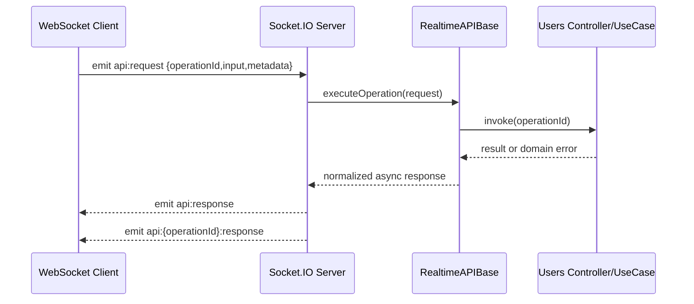

# API WebSocket em tempo real

Este guia é exclusivo para a interface em tempo real do Socket.IO.

## Glossário

- **Adapter de entrada** — aceita chamadas de protocolo externo e traduz para use-cases.

## Responsabilidade no escopo

- **Camada:** adapter / realtime
- **Responsável por:** wiring específico deste framework/tecnologia
- **Usado com:** composição do backend-template, pacotes de persistência/SDK, guia correspondente
- **Não responsável por:** regras de domínio, autoría OpenAPI ou storage offline no browser

## Por que existe

A escolha de framework fica na borda. Este adapter mantém detalhes Express/Fastify/DB/realtime substituíveis.

## O que é

Adapter WEBSOCKET API para interfaces realtime do Jumentix — monta use-cases sem vazar tipos de framework no domínio.

## Escopo

- Transporte: WebSocket (protocolo Socket.IO)
- Implementação do servidor: `apps/backend-template/src/interface/WebSocket/WebSocketAPI.ts`
- Cliente SDK: `sdk-clients/websocket/WebSocketApiClient.ts`
- Fonte AsyncAPI: `spec/asyncapi/1.0.0.websocket.yml`

## Referências de contrato

- Contratos em tempo real WebSocket
- [Contratos e respostas de erro](/docs/jumentix/reference/errors-responses)
- [Mapa de eventos e mensagens](/docs/jumentix/reference/events-messages)

## Endpoint e canais

- URL base: `ws://localhost:3001`
- Caminho Socket.IO: `/ws`
- Canal de solicitação genérico: `api:request`
- Canal de resposta genérico: `api:response`
- Solicitação por operação: `api:{operationId}:request`
- Resposta por operação: `api:{operationId}:response`

## Dimensionamento horizontal com adaptador Redis Streams

Para executar vários servidores Socket.IO com entrega consistente entre nós, habilite o adaptador Redis Streams:

```bash
JUMENTIX_WEBSOCKET_SOCKETIO_ADAPTER=redis-streams
JUMENTIX_WEBSOCKET_REDIS_URL=redis://127.0.0.1:6379/1
```

Ordem de resolução substituta para conexão Redis:

1. `JUMENTIX_WEBSOCKET_REDIS_URL`
2. `JUMENTIX_REDIS_URL`
3. `JUMENTIX_REDIS_HOST` + `JUMENTIX_REDIS_PORT` + `JUMENTIX_REDIS_DATABASE` (+ `JUMENTIX_REDIS_PASSWORD`)

Arquivos de implementação:

- `apps/backend-template/src/interface/WebSocket/adapters/socket-io/redisStreamsAdapter.ts`
- `apps/backend-template/src/interface/WebSocket/adapters/socket-io/socket-io.ts`

## Resiliência multithread com adaptador de cluster Socket.IO

Para escalar entre trabalhadores da CPU (vários threads/processos do Node.js no mesmo host), habilite:

```bash
JUMENTIX_WEBSOCKET_SOCKETIO_ADAPTER=cluster
JUMENTIX_WEBSOCKET_CLUSTER_WORKERS=4
```

Arquivos de implementação:

- `apps/backend-template/src/interface/WebSocket/adapters/socket-io/clusterAdapter.ts`
- `apps/backend-template/src/interface/WebSocket/adapters/start-websocket-api.ts`
- `apps/backend-template/src/interface/WebSocket/adapters/socket-io/socket-io.ts`

Notas:

1. O processo primário bifurca os trabalhadores e reinicia os trabalhadores mortos automaticamente.
2. Os processos de trabalho hospedam Socket.IO e compartilham eventos via `@socket.io/cluster-adapter`.
3. Para implantações de vários hosts, prefira o adaptador Redis Streams.

## Teste de validação de múltiplas instâncias

Um teste de integração dedicado valida a resiliência com 2 servidores Socket.IO + Redis:

- `apps/backend-template/test/integration/realtime/socketio.redis-streams.multi-instance.test.ts`

Execute-o com Docker:

```bash
bun run smoke:realtime:redis-streams
```

Ou execute apenas o teste (requer execução do Redis):

```bash
bun run test:integration:realtime:redis-streams
```

## Fluxo de tempo de execução



## Exemplo profundo: solicitação genérica + correlação ACK

```ts
import { io } from 'socket.io-client';
import { randomUUID } from 'crypto';

const socket = io('ws://localhost:3001', {
  path: '/ws',
  transports: ['websocket']
});

await new Promise<void>((resolve) => socket.on('connect', () => resolve()));

const requestId = randomUUID();
const channel = 'api:createOrganization:response';

socket.on(channel, (payload) => {
  if (payload?.metadata?.requestId !== requestId) return;
  console.log('Operation channel response:', payload);
});

socket.timeout(30000).emit(
  'api:request',
  {
    version: '1.0.0',
    operationId: 'createOrganization',
    authorization: 'Bearer <jwt>',
    input: {
      name: 'Acme Group',
      address: [],
      phone: [],
      email: []
    },
    metadata: { requestId }
  },
  (ackPayload) => {
    console.log('ACK response:', ackPayload);
  }
);
```

## Exemplo profundo: solicitação de canal por operação

```ts
import { io } from 'socket.io-client';

const socket = io('ws://localhost:3001', {
  path: '/ws',
  transports: ['websocket']
});

await new Promise<void>((resolve) => socket.on('connect', () => resolve()));

socket.emit(
  'api:getAllOrganizations:request',
  {
    version: '1.0.0',
    authorization: 'Bearer <jwt>',
    queryString: { page: 1, size: 20 },
    metadata: { requestId: 'req-001' }
  },
  (response) => {
    if (!response.ok) {
      console.error(response.error);
      return;
    }
    console.log(response.result);
  }
);
```

## Exemplo de SDK

```ts
import { WebSocketApiClient } from '../sdk-clients/websocket/WebSocketApiClient';

const client = new WebSocketApiClient('ws://localhost:3001');
client.connect();

const response = await client.request({
  version: '1.0.0',
  operationId: 'getAllOrganizations',
  authorization: 'Bearer <jwt>',
  queryString: { page: 1, size: 10 },
  metadata: { requestId: 'req-ws-01' }
});

console.log(response.result);
client.disconnect();
```

## Regras de resposta/tratamento de erros

1. `ok=true` significa que `resultado` é a carga útil de resposta para o `operationId`.
2. `ok=false` significa que `error` contém dados de erro normalizados.
3. `metadata.requestId` é a chave de correlação para corresponder às solicitações do cliente.
4. `metadata.channel` contém o canal de resposta usado pelo servidor.

## Orientação Operacional

1. Sempre envie `metadata.requestId` do cliente.
2. Assine `api:response` e ​​`api:{operationId}:response` ao construir clientes genéricos.
3. Mantenha uma estratégia de tempo limite e nova tentativa do lado do cliente para falhas transitórias de rede.

## Checklist júnior (“Eu consigo …”)

- [ ] Sei quando escolher este adapter
- [ ] Consigo iniciá-lo pelo script documentado
- [ ] Sei o próximo guia/pacote

## Próximo passo

Volte para [Começando](/docs/pt-BR/jumentix/concepts/getting-started) ou o guia correspondente.
