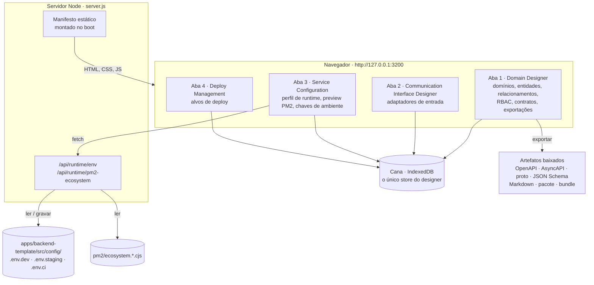
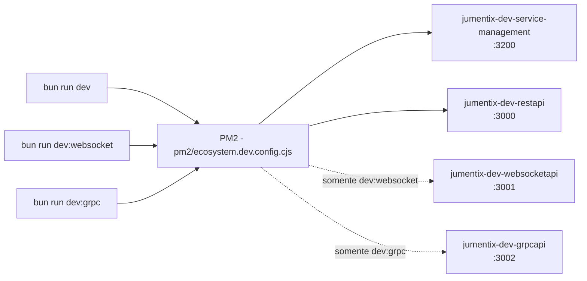
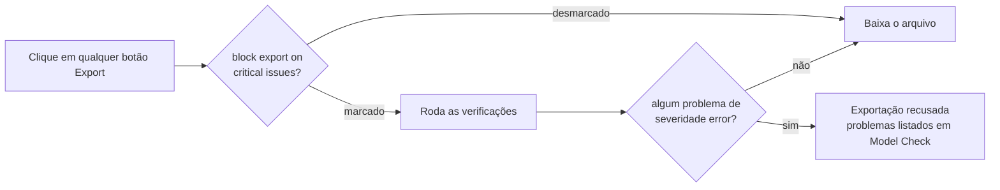
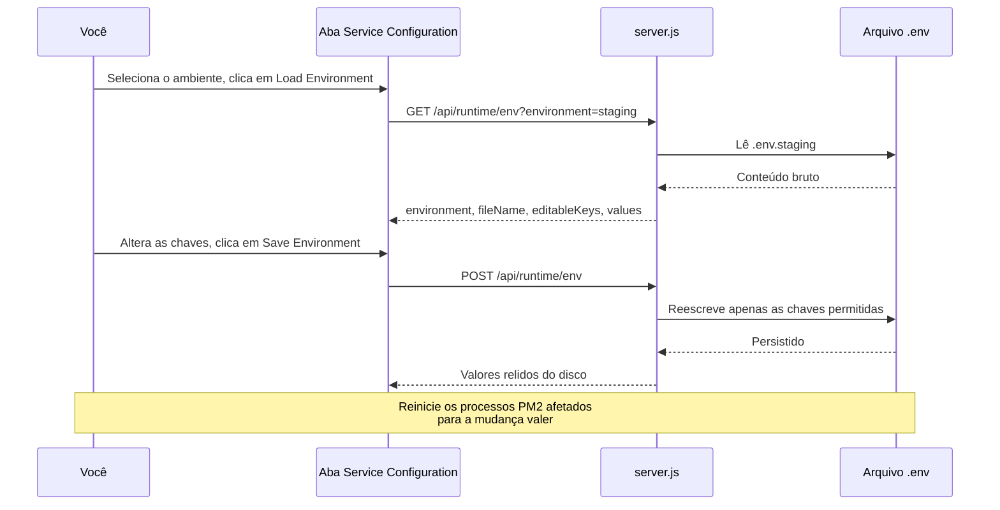
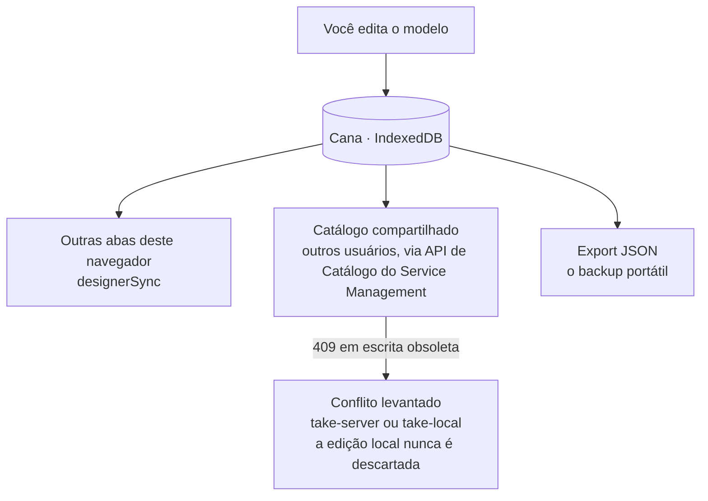
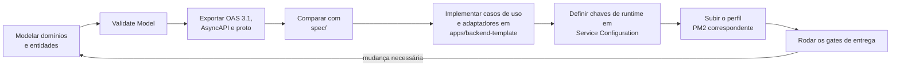

# Usando o Service Manager e o Domain Designer

Este guia leva você de um checkout limpo até um domínio modelado e exportado
como contratos e, em seguida, até um serviço em execução. Ele é ordenado por
tarefa: instalar, executar, modelar, validar, exportar, configurar o runtime,
registrar alvos de deploy e se recuperar quando algo quebra.

É a porta de entrada da cadeia de documentação do Service Management. Cada
seção aponta para o documento de referência que trata do assunto em
profundidade.

## 1. O que é o Service Manager

O Service Manager é uma aplicação de navegador local, sem build, servida por
HTTP puro do Node. É a superfície de design do monorepo: você modela domínios,
declara interfaces de comunicação, configura o perfil de runtime e registra
alvos de deploy.

Nada nele é maquete. Suas exportações são artefatos reais que você alimenta em
`apps/backend-template/`, e a aba Service Configuration escreve diretamente nos
arquivos de ambiente a partir dos quais o backend sobe.



Implementação:

| Caminho | Responsabilidade |
| --- | --- |
| `apps/service-management/index.html` | Estrutura de abas, painéis, import map |
| `apps/service-management/script.js` | Ligação do designer e handlers de evento |
| `apps/service-management/src/` | Módulos de store, sync, UI e PWA |
| `apps/service-management/server.js` | Servidor estático e as APIs de runtime |
| `packages/designer-core/` | Modelo, validação, exportadores e importadores sem DOM |
| `packages/cana/` | Adaptador IndexedDB usado como store do designer |

## 2. Pré-requisitos

- Bun `>=1.3.13` (o repositório fixa `bun@1.3.13`)
- Node.js `>=22.0.0 <23.0.0`
- PM2, instalado como dependência do workspace
- `rtk` para executar comandos do repositório
- Um navegador baseado em Chromium ou Firefox com IndexedDB habilitado

Instale as dependências do workspace uma vez:

```bash
rtk proxy bun install
```

## 3. Bundles vendorizados

A aplicação é uma SPA sem build que resolve dois specifiers bare pelo import map
do `index.html`: `@jumentix/cana` e `@jumentix/designer-core/`. Os dois alvos
ficam em `apps/service-management/vendor/`, são gitignorados e são gerados
localmente.

Os pontos de entrada de desenvolvimento geram para você — `dev:service-management`
e os scripts `pm2:start:dev:*` rodam a etapa de vendor antes de subir o
processo, então um clone novo sobe um designer funcional sem comando extra.

Gere à mão quando subir o servidor diretamente, sem PM2:

```bash
rtk proxy bun run service-management:vendor
```

Esse único script escreve o bundle de navegador do Cana em
`apps/service-management/vendor/cana/index.js` e espelha
`packages/designer-core/src` em
`apps/service-management/vendor/designer-core/`.

Sem os bundles, a página carrega, o shell aparece e todos os painéis ficam
inertes porque o grafo de módulos nunca resolve, com 404 repetidos de
`/vendor/...` no console do navegador. As suítes de integração de navegador
geram os bundles antes de subir o servidor, então um bundle desatualizado nunca
se disfarça de falha do designer no CI.

## 4. Executando a aplicação

### 4.1 Subir apenas ela

```bash
rtk proxy bun run dev:service-management
```

Isso inicia o processo PM2 `jumentix-dev-service-management` com o interpretador
Bun. Abra:

```text
http://127.0.0.1:3200
```

### 4.2 Subir junto com o backend

```bash
rtk proxy bun run dev
```

`dev` aponta para `pm2:start:dev:restapi`, que inicia
`jumentix-dev-service-management` e `jumentix-dev-restapi` a partir de
`pm2/ecosystem.dev.config.cjs`. Use as variantes realtime quando também precisar de um
processo WebSocket ou gRPC:

```bash
rtk proxy bun run dev:websocket
```

```bash
rtk proxy bun run dev:grpc
```



### 4.3 Executar sem PM2

```bash
NODE_ENV=dev bun apps/service-management/server.js
```

### 4.4 Variáveis de ambiente

Todas as variáveis abaixo têm o prefixo `JUMENTIX_SERVICE_MANAGEMENT_`, exceto
`NODE_ENV`.

| Variável | Padrão | Finalidade |
| --- | --- | --- |
| `…_PORT` | `3200` | Porta HTTP |
| `…_HOST` | `127.0.0.1` | Endereço de bind |
| `…_CONFIG_DIR` | `apps/backend-template/src/config` | Onde a API de runtime env lê e grava |
| `…_PM2_DIR` | `pm2/` | Onde o preview de ecossistema PM2 lê |
| `…_AUTH_TOKEN` | não definida | Exige `Authorization: Bearer <token>` no `POST` de ambiente |
| `…_STATIC_MANIFEST_REFRESH` | de `NODE_ENV` | `on-miss` refaz o manifesto estático; `boot-only` nunca refaz |
| `NODE_ENV` | `dev` | Ambiente de fallback quando a requisição não informa um |

O servidor **falha fechado no boot** quando o diretório configurado não existe:
imprime `Service Management config directory not found: <caminho>` em stderr e
sai com código `1`. Servir valores padrão para um diretório inexistente seria
violação de contrato, então ele se recusa a subir.

Portas por perfil PM2:

| Ecossistema | Processo | Porta |
| --- | --- | --- |
| `pm2/ecosystem.dev.config.cjs` | `jumentix-dev-service-management` | `3200` |
| `pm2/ecosystem.staging.config.cjs` | `jumentix-staging-service-management` | `4200` |
| `pm2/ecosystem.production.config.cjs` | `jumentix-prod-service-management` | `5200` |

### 4.5 Controle de processos

```bash
rtk proxy bun run pm2:list
```

```bash
rtk proxy bun run pm2:logs
```

Para reiniciar apenas esta aplicação depois de editar o código-fonte:

```bash
pm2 restart jumentix-dev-service-management
```

## 5. Primeiro boot

Em um perfil de navegador novo, o designer sobe com um **modelo vazio**. Cada
aba mostra um estado vazio guiado que nomeia a primeira ação daquela aba — não
existe template pré-carregado silenciosamente.


A primeira ação do Domain Designer é **Load Sample Model** (também disponível no
painel Export). Um clique carrega um domínio de identidade realista — `Users`,
`Organization`, `Email`, `Phone` e `ContactPoint`, os mesmos recursos que
`spec/1.0.0.yml` declara — com relacionamentos, RBAC por entidade, um contrato
de mensagem, invariantes e composição OpenAPI `oneOf` + discriminador.


O conteúdo de exemplo permanece distinguível do seu trabalho: todo id do
exemplo carrega o prefixo `sample-` e domínios de exemplo mostram o selo
`sample` na lista de domínios. Carregá-lo sobre um modelo existente pede
confirmação, e o desfazer restaura o modelo anterior. Excluí-lo é uma exclusão
de domínio comum.

Um primeiro ciclo completo:

1. Clique em `Load Sample Model`.
2. Clique em `Validate Model` e leia o painel Model Check.
3. Clique em `Export OAS 3.1` — o navegador baixa
   `domain-designer-oas-3.1.json`.
4. Exclua o domínio de exemplo e modele o seu.

## 6. Domain Designer

### 6.1 Canvas e navegação

| Controle | Efeito |
| --- | --- |
| `Ctrl/Cmd + roda do mouse`, `-` / `+` | Zoom |
| `Espaço + arrastar` | Deslocar o canvas |
| `Fit` | Enquadrar todo o modelo |
| `Reset View` | Restaurar a viewport padrão |
| `Snap: On` | Alternar o encaixe na grade |
| `Compact View` | Recolher os cards de entidade até o cabeçalho |
| `Large Canvas: Off` | Alternar o modo de performance para alta densidade |
| `Auto Layout` | Reorganizar domínios e entidades |
| `Curved` / `Orthogonal` | Estilo de roteamento dos relacionamentos |
| Mini-mapa | Move a viewport para um domínio com um clique |

Atalhos de teclado. Todos se desativam enquanto o foco está em um `input`,
`textarea` ou `select`:

| Atalho | Ação |
| --- | --- |
| `Ctrl/Cmd + Z` | Desfazer |
| `Ctrl/Cmd + Shift + Z`, `Ctrl/Cmd + Y` | Refazer |
| `Setas` | Mover a entidade selecionada em 8px |
| `Shift + Setas` | Mover em 16px |
| `Delete` / `Backspace` | Excluir o relacionamento selecionado, ou a entidade selecionada após confirmação |
| `Alt + L` | Auto layout |
| `Alt + R` | Iniciar um relacionamento a partir da entidade selecionada |
| `Alt + V` | Alternar a visão compacta |
| `Escape` | Cancelar o modo de seleção, cancelar um arraste de âncora, limpar a seleção de relacionamento |

Todo desfecho — sucesso, recusa e motivo — é anunciado na região de status
abaixo da barra de abas, que também é uma live region para leitores de tela.
Quando uma ação parece não fazer nada, leia essa linha primeiro.

### 6.2 Domínios e contexto delimitado

Crie, renomeie, exclua e colora domínios pelo painel **Domains**. Com um domínio
selecionado, o painel **Bounded Context** captura os metadados estratégicos:
linguagem ubíqua, time responsável, dependências upstream e downstream, canal de
integração, dependências de pacotes e objetos de valor compartilhados. Clique em
`Save Context` para persistir e em `Clear` para limpar.

Esses metadados acompanham as exportações JSON, Markdown e de pacote de domínio.

### 6.3 Entidades, campos e templates

Com uma entidade selecionada, o Entity Inspector oferece `Save Name`,
`Move Domain`, `Duplicate`, `Delete` e `Save Rules` para a flag de raiz de
agregado e as invariantes (uma regra por linha). Raízes de agregado exibem o
marcador `AR` no card.


Os campos carregam metadados alinhados ao OpenAPI:

| Atributo | Valores |
| --- | --- |
| `type` | `string`, `integer`, `number`, `boolean`, `array`, `object`, `date`, `datetime`, `uuid` |
| `format` | `uuid`, `date`, `date-time`, `email`, `uri` |
| Flags | `required`, `PK`, `FK`, `unique`, `nullable` |
| `enum` | Valores permitidos, separados por vírgula |
| Metadados estendidos | `description`, `pattern`, `minLength`, `maxLength`, `minimum`, `maximum`, `itemsType`, pelo botão `meta` na linha do campo |

Templates de campo adicionam um conjunto fixo de campos, ignorando nomes já
ocupados:

| Template | Campos adicionados |
| --- | --- |
| `tenantRef` | `organizationId` (uuid, obrigatório, FK) |
| `auditTrail` | `createdBy`, `updatedBy` (uuid, obrigatórios, FK) |
| `softDelete` | `isDeleted` (boolean, obrigatório), `deletedAt` (datetime, nullable) |
| `contactPack` | `emails`, `phones` (array de string) |

Templates de entidade remodelam a entidade inteira: `crudAggregate`,
`eventSourced`, `referenceData` e `tenantOwned`.

O inspector também renderiza um **API preview (OpenAPI CRUD)** — as cinco rotas
que o exportador vai emitir para a entidade, para você ver o contrato antes de
exportá-lo.

### 6.4 Relacionamentos

Três formas de criar um:

- selecione origem e destino no painel **Relationship** e clique em `Connect`;
- clique em `Pick On Canvas` e clique nas duas entidades;
- arraste de uma âncora de borda (`top`, `right`, `bottom`, `left`) até outra
  entidade.

Deixe `auto FK` marcado para gerar a chave estrangeira no lado de destino.

Com um relacionamento selecionado você ajusta cardinalidade (`1` ou `N` por
lado), deslocamento do rótulo (`x`, `y`, mais `Reset Label Pos`), curvatura do
caminho (`bendX`, `bendY`), comportamento da âncora (`auto` ou `center`) e
estilo de roteamento. Clique em `Save Relationship` para aplicar e `Reverse`
para inverter o sentido.

Duas travas valem na criação: origem e destino precisam ser entidades
diferentes, e não é possível duplicar um relacionamento entre o mesmo par.

### 6.5 RBAC, contratos de mensagem e composição OpenAPI

Para cada entidade e ação (`list`, `getById`, `create`, `update`, `delete`),
marque `superadmin`, `admin` e `user` e clique em `Save RBAC Rule`. O escopo por
tenant é **derivado dos papéis**, não definido à mão: `admin` e `user` ficam no
escopo da própria organização e `superadmin` é global, que é o que o runtime
aplica. Escopos diretos legados continuam funcionando, mas não são editáveis
aqui.


Declare contratos `event`, `command`, `request` e `response` por entidade com
nome, canal ou tópico, versão e um schema JSON de payload. `Add Contract`
registra um; o botão `payload` de um contrato listado edita o schema. JSON
inválido é recusado com mensagem explícita.

Por entidade, escolha o modo de composição OpenAPI (`oneOf`, `allOf`, `anyOf`),
liste schema refs, adicione `$ref` externos e defina a propriedade
discriminadora, e então `Save OAS Composition`.

Onde isso aterrissa nos documentos exportados — e as garantias exatas de
fidelidade de cada travessia — é assunto de
[Garantias de Paridade de Contrato](/docs/pt-BR/jumentix/reference/service-management-contract-parity).

### 6.6 Validação, gate de exportação e diff de schema

`Validate Model` roda as verificações do modelo. Cada problema tem severidade
(`error`, `warn`, `info`) e aparece prefixado. O seletor de severidade mínima
filtra a lista.


Marque **block export on critical issues** para transformar a validação em gate
rígido. Todas as rotas de exportação chamam o gate antes e recusam enquanto
houver qualquer problema de severidade `error`.



Para controle de mudança, `Save Baseline` tira um snapshot do schema atual e
`Run Diff` compara o modelo com ele, reportando domínios, entidades, campos,
relacionamentos e contratos criados e removidos, e sinalizando mudanças de tipo
e de obrigatoriedade como dicas de migração. `Clear Baseline` remove o snapshot.

### 6.7 Geração, exportação e importação

`Code Preview` renderiza esqueletos de modelo de domínio, porta de repositório,
caso de uso, controller e handler. `Generate Examples` renderiza exemplos de
payload de request e response. Selecione uma entidade para limitar a saída, ou
deixe nada selecionado para gerar a partir de todo o canvas.


| Botão | Arquivo baixado | Uso |
| --- | --- | --- |
| `Export JSON` | `domain-designer.json` | Backup completo do modelo, reimportável |
| `Export OAS 3.1` | `domain-designer-oas-3.1.json` | Contrato REST |
| `Export Markdown` | `domain-designer-model.md` | Documentação legível do modelo |
| `Export JSON Schema` | `domain-designer-json-schema.json` | Schemas de validação |
| `Export AsyncAPI` | um `<versão>.<transporte>.yml` por transporte | Contratos de eventos e mensagens |
| `Export Proto` | `async-api.proto` | Definição de serviço gRPC |
| `Export Boilerplate Bundle` | `domain-designer-boilerplate-bundle.json` | Entrada de scaffolding para o backend template |
| `Export Package` | `<dominio>-package.json` | Um domínio, compartilhável e reimportável |

A exportação de pacote usa o domínio selecionado como fonte, então selecione um
domínio antes. Os alvos de importação são `Import JSON`, `Import OAS 3.1` e
`Import Package`; cada motivo de falha mapeia para uma mensagem de status
explícita.

Versionamento de pacote de domínio, grafos de dependência e política de
conflito são assunto de
[Colaboração e Empacotamento](/docs/pt-BR/jumentix/reference/service-management-collaboration-packaging).

## 7. Communication Interface Designer

Registre os adaptadores de entrada que vão servir as operações modeladas.


O candidato é validado **antes** de tocar o estado, e a recusa se explica na
região de status:

| Campo | Regra |
| --- | --- |
| Interface Type | `HTTP/REST`, `gRPC`, `WebSocket`, `SSE Server` |
| Framework/Runtime | Segue o tipo de interface, vindo da matriz canônica de runtime. WebSocket oferece `socket-io`; gRPC oferece `grpc`; HTTP/REST e SSE oferecem os onze frameworks HTTP, na grafia canônica (`derby-js`, `sails-js`) |
| Entrypoint | Um caminho TypeScript/JavaScript **sob `src/interface/`**, por exemplo `src/interface/HTTP/adapters/start-rest-api.ts` |
| Controller mapping | O formato `XController.action`, por exemplo `UsersController.create` |

Duplicatas são detectadas e recusadas. Tipo e framework permanecem
selecionados após uma inclusão bem-sucedida, então registrar vários adaptadores
do mesmo tipo não exige escolhê-los de novo a cada vez.

## 8. Service Configuration


### 8.1 Perfil de runtime

| Controle | Valores |
| --- | --- |
| Service Kind | `REST API`, `WebSocket API + REST API`, `gRPC API + REST API` |
| Run Mode | Servidor dedicado (SSH), Máquina virtual (SSH), Container, Functions |
| Cloud Provider | AWS, Google Cloud, Azure, Vercel, Cloudflare, Docker, Self Hosted |
| Caminho de assets estáticos | Opcional, por exemplo `public/` |
| Portas | REST, WebSocket, gRPC |

`Save Profile` valida antes de gravar: portas fora da faixa, portas colidindo
entre os protocolos que o service kind escolhido realmente vincula, e
combinações de run mode × provedor sem alvo de deploy na matriz do Requisito
`059` são recusadas com o motivo na superfície de status.

### 8.2 Preview do ecossistema PM2

O preview lê os arquivos reais `pm2/ecosystem.*.cjs` por
`GET /api/runtime/pm2-ecosystem`, então adicionar uma app a um arquivo de
ecossistema muda o preview sem mudança de código, e nenhuma invocação de
gerenciador de pacotes fica embutida em lugar nenhum. `ci`/`test` mapeiam para
um arquivo que não existe no repositório; o endpoint reporta isso como um
estado explícito `exists: false`, e não como erro nem como lista vazia
silenciosa.

### 8.3 Variáveis de ambiente de runtime

O editor expõe as chaves de runtime em dois níveis. A lista de escrita é uma
decisão de segurança, fixada pelo Requisito `126`:

| Nível | Chaves |
| --- | --- |
| Editável | `JUMENTIX_HTTP_FRAMEWORK`, `JUMENTIX_REALTIME_API`, `JUMENTIX_REALTIME_API_PROTOCOL`, `JUMENTIX_REALTIME_API_DATABASE_DRIVER`, `JUMENTIX_DATABASE_DRIVER`, `JUMENTIX_KEYVALUESTORAGE_DRIVER`, `JUMENTIX_MESSAGE_MEDIATOR_ADAPTER`, `JUMENTIX_WEBSOCKET_SOCKETIO_ADAPTER`, `JUMENTIX_WEBSOCKET_REDIS_URL` |
| Somente leitura | Endpoints de conexão e configuração não secreta, como `JUMENTIX_DATABASE_NAME`, `JUMENTIX_REDIS_HOST`, `JUMENTIX_RABBITMQ_EXCHANGE`, `JUMENTIX_CORS_ALLOWED_ORIGINS` |
| Nunca exposto | Chaves com credenciais, como `JUMENTIX_JWT_TOKEN_SECRET_KEY`, `JUMENTIX_REDIS_PASSWORD`, `JUMENTIX_RABBITMQ_URL` — garantido por omissão das duas listas |

Cada chave editável é restrita a um enum canônico, então o editor não consegue
gravar um valor que o backend recusaria no bootstrap.

Escolha o ambiente, clique em `Load Environment`, altere o que precisar e
clique em `Save Environment`. O painel nomeia o arquivo exato que está editando.



Nomes de ambiente mapeiam para arquivos:

| Ambiente selecionado | Arquivo |
| --- | --- |
| `dev`, `development` | `.env.dev` |
| `staging` | `.env.staging` |
| `ci`, `test` | `.env.ci` |

Qualquer outro valor é recusado com HTTP 400 nomeando o conjunto aceito.

### 8.4 Usando as APIs diretamente

```bash
curl "http://127.0.0.1:3200/api/runtime/env?environment=dev"
```

```bash
curl "http://127.0.0.1:3200/api/runtime/pm2-ecosystem?environment=dev"
```

```bash
curl -X POST http://127.0.0.1:3200/api/runtime/env \
  -H 'content-type: application/json' \
  -d '{"environment":"dev","values":{"JUMENTIX_HTTP_FRAMEWORK":"fastify"}}'
```

Quando `JUMENTIX_SERVICE_MANAGEMENT_AUTH_TOKEN` está definida, o `POST` exige
`Authorization: Bearer <token>` e responde 401 sem ele. As leituras não são
protegidas pelo token.

Os envelopes de falha são distintos de propósito: corpo malformado ou valor
recusado é HTTP 400 com `error` e `details`; ambiente não suportado é HTTP 400
nomeando os valores aceitos; falha de sistema de arquivos é HTTP 500 com
`error`, `code`, `path` e `details`. Um arquivo de ecossistema quebrado reporta
separadamente como `PM2 ecosystem file operation failed.`

Toda mutação é registrada no servidor com timestamp, ambiente e nomes das
chaves alteradas.

A semântica dos arquivos de ambiente, os conjuntos de enum e os caminhos fixos
são assunto de
[Contratos de Ambiente de Runtime](/docs/pt-BR/jumentix/reference/service-management-runtime-environment).

## 9. Deploy Management

Registre alvos de deploy com nome, tipo de alvo, tipo de serviço, região e
versão de runtime. Alvos gerenciados por PM2 também recebem um perfil PM2.


O formulário valida contra a matriz de deploy do Requisito `059` e explica cada
recusa:

| Tipo de alvo | Tipos de serviço que pode rodar | Perfil PM2 | Região significa |
| --- | --- | --- | --- |
| `dedicated-server`, `vm`, `ec2` | `restapi`, `websocket+restapi`, `grpc+restapi` | Obrigatório (`dev`, `staging`, `production`) | Host SSH ou endereço da instância |
| `lambda`, `vercel-functions`, `cloudflare-workers` | `functions` | Não se aplica | Região do provedor |

O campo runtime/versão espera nome mais versão, como `nodejs22.x` — um nome de
runtime sozinho é recusado. Alvos podem ser editados no lugar e duplicados;
`Cancel` abandona uma edição sem aplicá-la.

A matriz, o contrato de metadados e as regras de ciclo de vida são assunto de
[Console de Operações](/docs/pt-BR/jumentix/reference/service-management-operations-console).

## 10. Onde seu trabalho é guardado

O Cana (IndexedDB) é o **único** store do designer. Não há fallback para
localStorage nem chave de driver: nenhuma variável de ambiente e nenhum
parâmetro de URL roteia o designer para outro store. Um host que não consegue
resolver o bundle do Cana recebe um store cujas operações reportam
`unavailable` — um estado terminal explícito que o boot expõe, nunca um
fallback silencioso.



Três consequências que vale conhecer antes de confiar nisso:

- **Durabilidade é reportada, não presumida.** Quando o navegador não concedeu
  armazenamento persistente, a região de status avisa: o armazenamento funciona,
  mas o navegador pode recuperá-lo sob pressão.
- **Edições em várias abas convergem.** Uma segunda aba do mesmo navegador vê
  suas mudanças pelo fluxo de eventos comitados; aplicações remotas não entram
  no desfazer e nunca importam seleção.
- **Limpar os dados do site apaga o modelo.** A ação "Reset app shell" do PWA
  toca apenas os caches `service-management-shell@*` e nunca os dados do
  designer — mas o "limpar dados do site" do navegador remove os dois.

Exporte um modelo JSON antes de qualquer mudança arriscada: esse arquivo é o
único backup portátil.

Estados de armazenamento, a migração unidirecional e a matriz offline são
assunto de
[Adoção do Cana, Migração e Comportamento Offline](/docs/pt-BR/jumentix/reference/service-management-cana-adoption).
Os fluxos de instalação, atualização e recuperação são assunto de
[Design System e Shell PWA](/docs/pt-BR/jumentix/reference/service-management-design-system-pwa).

## 11. Do modelo ao serviço em execução



1. Modele os domínios e entidades.
2. Rode `Validate Model` e resolva todos os erros.
3. Exporte OpenAPI 3.1 e, para serviços orientados a eventos, AsyncAPI e o
   proto.
4. Compare a saída com as especificações canônicas em `spec/`.
5. Implemente os casos de uso e adaptadores em `apps/backend-template/`.
6. Defina as chaves de runtime em Service Configuration.
7. Suba o perfil PM2 correspondente e rode os gates de entrega.
8. Salve um baseline de schema antes da próxima rodada de modelagem, para que o
   diff seguinte produza dicas de migração.

## 12. Solução de problemas

### A página carrega mas todos os painéis ficam inertes

Faltam os bundles vendorizados. Rode `bun run service-management:vendor` e
recarregue. Os pontos de entrada de desenvolvimento fazem isso por você; subir o
`server.js` diretamente, não. Nesse estado o console do navegador mostra 404 repetidos para
`/vendor/...`.

### O servidor sai imediatamente

Ele falha fechado quando o diretório de configuração não existe, imprimindo
`Service Management config directory not found: <caminho>`. Execute a partir da
raiz do repositório, ou aponte `JUMENTIX_SERVICE_MANAGEMENT_CONFIG_DIR` para um
diretório existente.

### Porta já em uso

```bash
lsof -ti tcp:3200 | xargs kill
```

```bash
JUMENTIX_SERVICE_MANAGEMENT_PORT=3300 bun apps/service-management/server.js
```

Mudar a porta muda a origem no navegador, e o IndexedDB tem escopo por origem —
um modelo salvo em `127.0.0.1:3200` não aparece na porta `3300`.

### Um arquivo novo retorna 404

O manifesto estático é montado uma vez, no boot, de propósito: servir a partir
de uma lista pré-construída limita a superfície servível. Em desenvolvimento o
manifesto é refeito **em uma falha de busca**; em qualquer outro modo, não.
Defina `JUMENTIX_SERVICE_MANAGEMENT_STATIC_MANIFEST_REFRESH=on-miss` para optar
por isso, ou reinicie o processo.

### Uma ação parece não fazer nada

Leia a região de status abaixo da barra de abas. Os formulários de adaptador,
perfil de serviço e alvo de deploy validam antes de tocar o estado e explicam
cada recusa ali.

### Uma exportação não faz nada

O gate de qualidade da exportação está ligado. Desmarque **block export on
critical issues**, ou rode `Validate Model` e resolva todas as entradas
`ERROR`.

### `Delete`, as setas ou `Espaço + arrastar` não funcionam

Os handlers de teclado se desativam enquanto o foco está em um `input`,
`textarea` ou `select`. Clique numa área vazia do canvas antes.

### `Load Environment` ou `Save Environment` falha

Verifique o envelope da resposta. Um 400 nomeia um ambiente não suportado ou um
valor recusado; um 500 traz `code` e `path` da falha de sistema de arquivos. Um
401 significa que `JUMENTIX_SERVICE_MANAGEMENT_AUTH_TOKEN` está definida e a
requisição não trouxe o bearer token correspondente.

### Uma chave de runtime salva não faz efeito

Arquivos de ambiente são lidos na inicialização do processo. Reinicie o
processo PM2 afetado:

```bash
pm2 restart jumentix-dev-restapi
```

### O modelo desapareceu

O IndexedDB tem escopo por origem e é removido por "limpar dados do site".
Restaure com `Import JSON` a partir de um backup exportado. Se a região de
status reportou durabilidade degradada, o navegador pode ter recuperado o
armazenamento.

## 13. Verifique sua instalação

```bash
rtk proxy bun run test:integration:service-management
```

A suíte cobre o servidor estático e o manifesto, a API de runtime env e seu
contrato, o endpoint de ecossistema PM2, o primeiro boot, o boot da SPA, a
migração do Cana, o sync entre abas, a matriz de persistência offline, o shell
PWA, os adaptadores de interface, o ciclo de vida dos alvos de deploy e o sync
de catálogo.

## Referências

- [Contratos de Ambiente de Runtime](/docs/pt-BR/jumentix/reference/service-management-runtime-environment)
- [Recursos e Uso do Domain Designer](/docs/pt-BR/jumentix/reference/domain-designer-features)
- [Arquitetura de Módulos e a Porta IDesignerStore](/docs/pt-BR/jumentix/reference/service-management-module-architecture)
- [Garantias de Paridade de Contrato](/docs/pt-BR/jumentix/reference/service-management-contract-parity)
- [Console de Operações](/docs/pt-BR/jumentix/reference/service-management-operations-console)
- [Adoção do Cana, Migração e Comportamento Offline](/docs/pt-BR/jumentix/reference/service-management-cana-adoption)
- [Design System e Shell PWA](/docs/pt-BR/jumentix/reference/service-management-design-system-pwa)
- [Colaboração e Empacotamento](/docs/pt-BR/jumentix/reference/service-management-collaboration-packaging)
- [Criando SPA/PWA com Jumentix](/docs/pt-BR/jumentix/guides/spa-pwa)
- [Criando uma API REST com Jumentix](/docs/pt-BR/jumentix/guides/rest-api)
