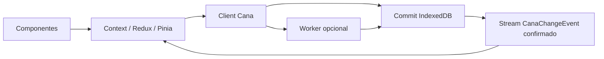
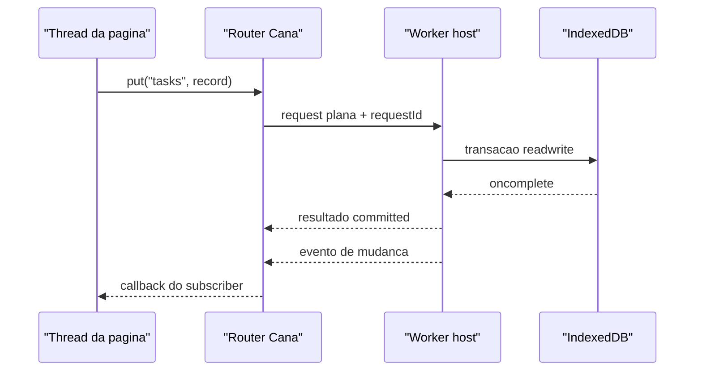
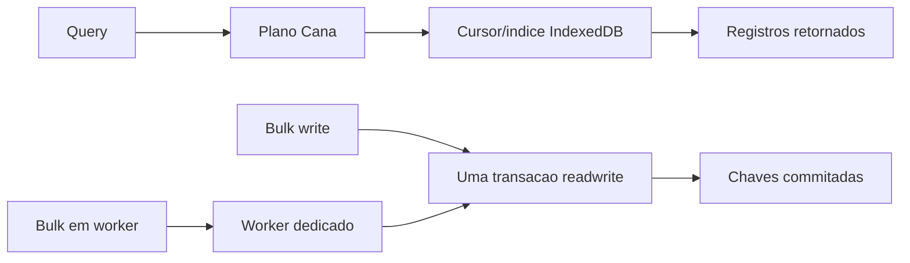

# @jumentix/cana

Adaptador de banco de dados offline sobre IndexedDB para aplicações Jumentix.

O seed de frontend (`apps/frontend`) abre o Cana antes do login e sincroniza
pela OAS: [Camada de dados offline do frontend](/docs/pt-BR/jumentix/reference/frontend-offline-data-layer).

<figure className="cana-brand-scene">
  
  <figcaption>
    O Cana mantém dados duráveis no navegador perto da aplicação: cana como
    combustível, Jumentix totalmente energizado e persistência fora do caminho da UI.
  </figcaption>
</figure>

```ts
import { createClient } from '@jumentix/cana';

const client = createClient({
  name: 'tasks-app',
  schema: {
    version: 1,
    stores: [
      { name: 'categories', keyPath: 'id', indexes: [{ name: 'byName', keyPath: 'name' }] },
      {
        name: 'tasks',
        keyPath: 'id',
        indexes: [
          { name: 'byCategory', keyPath: 'categoryId' },
          { name: 'byUpdatedAt', keyPath: 'updatedAt' }
        ]
      }
    ]
  }
});

await client.open();
await client.table('categories').put({ id: 'work', name: 'Work' });
await client.table('tasks').add({
  id: 'task-1',
  title: 'Write the Cana tutorial',
  categoryId: 'work',
  completed: false,
  updatedAt: Date.now()
});
```

## Responsabilidade no escopo

- **Camada:** persistência offline / browser
- **Responsável por:** API de cliente IndexedDB para PWAs
- **Usado com:** `@jumentix/cana-react`, `@jumentix/cana-vue`, designer-core, guia SPA/PWA, service-management
- **Não responsável por:** bancos server-side, Redis KV, REST/WebSocket

## Três coisas a saber antes de usar

**IndexedDB é o banco durável do navegador.** O Cana mantém a API pública perto
da semântica do IndexedDB: `open()` explícito, versões de schema estáveis,
tabelas indexadas, transações atômicas e eventos de mudança já commitados. Se a
aplicação precisa de diagnóstico de storage, use `storageState()` e
`durabilityAssessment()` depois que o client abre.

**Escritas têm três desfechos, não dois.** `committed | rolled-back | unknown`.
O terceiro cobre uma transação derrubada sem que nenhum dos dois eventos
dispare — um worker morto, uma aba fechada. Ative `operationLedger: true` e
`resolveWrite()` responderá de forma definitiva, porque o id da operação é
gravado dentro da mesma transação que os dados.

**Nunca dê `await` em algo que não seja uma requisição do IndexedDB dentro de
uma transação.** A transação faz auto-commit assim que o event loop cede sem
requisições pendentes, então `await fetch(...)` não pausa a transação — ele a
encerra. O Cana reporta a violação como `TransactionInactive` em vez de deixar
uma `DOMException` crua escapar.

## Erros são dados puros

`CanaError` não é uma subclasse de `Error`, porque o structured clone não
preserva identidade de classe ao atravessar o armazenamento ou a fronteira de um
worker — uma verificação `instanceof` passaria a retornar `false` sem avisar.
Use os guards:

```ts
import { isCanaError, isCanaErrorCode } from '@jumentix/cana';

try {
  await client.table('tasks').add({
    id: 'task-1',
    title: 'Write the Cana tutorial',
    categoryId: 'work',
    completed: false,
    priority: 'high',
    createdAt: Date.now(),
    updatedAt: Date.now()
  });
} catch (error) {
  if (isCanaErrorCode(error, 'QuotaExceeded')) {
    console.warn('Storage quota is full. Export or clear local data before retrying.');
  } else if (isCanaError(error)) {
    console.warn(`Cana failed with ${error.code}: ${error.message}`);
  } else {
    throw error;
  }
}
```

## Experimente no navegador

Execute um primeiro client contra IndexedDB nesta página:

<CanaPlayground id="getting-started" />

## Design notes

O Cana é intencionalmente mais próximo de um pequeno motor de banco de dados no
navegador do que de uma store de estado de frontend. O IndexedDB é responsável
pelo armazenamento durável; o Cana adiciona a superfície de cliente, desfechos
explícitos de transação, replay de mudanças, reconciliação após falha e uma
fronteira opcional de worker para aplicações que precisam tirar persistência da
thread de UI.


### Modelo mental em 30 segundos



Leia o diagrama da esquerda para a direita quando o usuário age, e da direita
para a esquerda quando a escrita faz commit:

1. Componentes chamam uma action do framework.
2. A action escreve em `categories` ou `tasks` pelo Cana.
3. IndexedDB confirma ou reverte de forma atômica.
4. Cana emite um evento confirmado.
5. Context, Redux ou Pinia atualiza o estado renderizado a partir desse evento.

### Arquitetura no estilo Postgres

A analogia é limitada, mas útil. O PostgreSQL registra mudanças com
[write-ahead logging](https://www.postgresql.org/docs/current/wal-intro.html),
separa trabalho de primeiro plano de manutenção com processos como o
[background writer](https://www.postgresql.org/docs/current/runtime-config-resource.html)
e permite que extensões executem
[background workers](https://www.postgresql.org/docs/current/bgworker.html). O
Cana mapeia essas ideias para primitivas do navegador em vez de entregar um
servidor:

- **Camada de armazenamento:** IndexedDB é a camada durável de stores/páginas e
  é quem controla commit e rollback atômicos. O fallback em localStorage é
  explícito e degradado.
- **Fronteira de commit:** uma transação Cana é a unidade de durabilidade. Os
  eventos de mudança ficam em buffer durante o corpo e só são liberados após
  `oncomplete` do IndexedDB, então subscribers nunca reagem a escritas que
  depois sofrem rollback.
- **Stream lógico de mudanças:** subscribers recebem `CanaChangeEvent`
  confirmados, com cursores monotônicos. `sinceCursor` consegue fazer replay de
  uma janela retida e limitada; se o cursor pedido ficou antigo demais, o Cana
  informa que a UI precisa ressincronizar em vez de fingir que o replay foi
  completo.
- **Reconciliação de crash:** `operationLedger: true` grava um registro de
  operação na mesma transação dos dados. Depois de um worker morto, aba fechada
  ou resposta perdida, `resolveWrite()` consegue distinguir `committed`,
  `rolled-back` e `unresolvable`.
- **Fronteira com state management:** Cana não substitui React Context, Redux,
  Pinia, Zustand ou outra store de UI. O formato recomendado é tratar o Cana
  como fonte durável da verdade, ouvir os eventos do Cana e atualizar a store do
  framework a partir desses eventos já commitados.

### Modelo de workers

`createWorkerHost()` executa um client Cana real atrás de um `MessagePort` ou de
um `Worker` dedicado. `createRouter()` e `createWorkerClient()` ficam no lado da
página e transformam chamadas tipadas em mensagens de dados puros.

- As mensagens carregam apenas dados compatíveis com structured clone: funções,
  objetos DOM, instâncias de `IDBRequest`, instâncias de classe e subclasses de
  `Error` não atravessam a fronteira.
- Toda requisição carrega um `requestId`, porque um worker pode responder
  requisições concorrentes fora de ordem.
- O timeout padrão de requisição é de 15 segundos. Leituras que expiram reportam
  `Unavailable`; escritas que expiram reportam `UnknownOutcome`, porque o worker
  pode ter commitado antes de morrer ou antes de postar a resposta.
- O host transmite mudanças commitadas como `{ kind: 'change', event }`, que é o
  gancho usado nos tutoriais de React Context, Redux e Pinia para atualizar o
  estado dos componentes.
- Corpos de `transaction()` com múltiplas operações não atravessam a fronteira
  do worker porque o corpo é uma função. Execute essa transação dentro do
  worker, ou envie escritas individuais pelo `createWorkerClient()`.



### Dados de performance

A suíte de performance do Cana no navegador roda contra IndexedDB real em disco
e usa asserções de forma algorítmica em vez de relógio. Limites absolutos de
milissegundos são ruidosos entre browsers, discos e runners compartilhados, mas
`recordsExamined`, `cursorAdvanced` e planos de query mostram se o engine pediu
ao navegador a quantidade certa de trabalho.


#### Como ler os dados

O Cana mede duas coisas diferentes:

- **Forma algorítmica:** o que o engine pede para o IndexedDB executar. A suíte
  automatizada valida registros examinados, avanço de cursor e escolha de índice
  em vez de inferir performance por relógio de CI.
- **Tempo local de execução:** uma amostra de referência em browser. Esses
  números ajudam a formar intuição, mas não são SLA de latência.



#### Modelo algorítmico

| Caminho | Forma algorítmica | O que a implementação evita |
| --- | --- | --- |
| Query limitada | `O(limit)` depois que o cursor abre. | Ler a store inteira e cortar o array em JavaScript. |
| Busca indexada | Modelo comum de índice do IndexedDB: `O(log n + matches)`. | Anunciar um índice no `explain()` enquanto ainda faz full scan. |
| `get()` por chave primária | Modelo comum de busca por chave no IndexedDB: `O(log n)`. | Varrer linhas para encontrar uma chave conhecida. |
| `count()` nativo | Uma requisição nativa `count()` do IndexedDB; o Cana não materializa linhas em JavaScript. O custo interno do browser depende da implementação. | Contar lendo todos os registros. |
| `bulkAdd()` | `O(n)` escritas em uma transação IndexedDB. | Disparar um fan-out grande e desordenado de promises que perde a ordem de entrada e a posição de falha parcial. |
| `bulkAdd()` via worker | Ainda é `O(n)` de trabalho de storage, mais overhead de structured clone e mensagens. | Bloquear a thread da página enquanto o caminho de persistência prepara e commita o lote. |
| Shards paralelos em workers | Alvo de wall-clock `O(n / w)` para bancos independentes ou shards independentes, com trabalho total `O(n)`. Locks de storage do browser podem limitar o ganho. | Fingir que vários workers tornam paralela uma única transação IndexedDB no mesmo object store. |
| Paginação profunda | `O(offset + limit)` de movimento de cursor, com clone para JavaScript só dos registros retornados. | Ler milhares de registros em um array antes de aplicar `offset`. |

#### Referência medida

Estes números são uma amostra local de referência, não um SLA de latência. Eles
foram medidos em 2026-08-13 com Chrome 151 headless, Cypress 15.19.0, Bun 1.3.13
e Node 22.23.1 no macOS 26.5.2, Apple M5, arm64, 24 GB RAM. O benchmark usou um
banco IndexedDB novo por cenário, o source do Cana empacotado para browser, uma
store `rows` com chave primária `id` e índices `byGroup` / `byValue`, e validou
quantidade de chaves commitadas antes de apagar cada banco. Leituras mostram a
mediana de cinco execuções salvo quando indicado; escritas em lote mostram uma
execução medida porque cada execução grava uma massa nova de dados.

| Operação | Registros na store | Query / tamanho do resultado | Complexidade usada no exemplo | Mediana local |
| --- | ---: | --- | --- | ---: |
| `bulkAdd()` | 1.000 | escreve 1.000 linhas | `O(n)` | 172,6 ms |
| `bulkAdd()` | 10.000 | escreve 10.000 linhas | `O(n)` | 1.811,8 ms |
| `bulkAdd()` via worker | 10.000 | 1 worker dedicado escreve 10.000 linhas | `O(n)` mais overhead de mensagem | 1.815,4 ms |
| `bulkAdd()` paralelo em workers | 10.000 total | 4 workers dedicados x 2.500 linhas em bancos independentes | alvo `O(n / w)` wall-clock, trabalho total `O(n)` | 1.442,6 ms |
| Query limitada | 1.000 | `limit: 10`, retorna 10 linhas | `O(limit)` | 1,5 ms |
| Query limitada | 10.000 | `limit: 10`, retorna 10 linhas | `O(limit)` | 0,6 ms |
| Busca indexada | 1.000 | 100 grupos, `equals: 'g7'`, retorna 10 linhas | `O(log n + matches)` | 1,1 ms |
| Busca indexada | 10.000 | 100 grupos, `equals: 'g7'`, retorna 100 linhas | `O(log n + matches)` | 2,7 ms |
| `get()` por chave primária | 1.000 | chave `500` | `O(log n)` | 0,3 ms |
| `get()` por chave primária | 10.000 | chave `5000` | `O(log n)` | 0,3 ms |
| `count()` nativo | 10.000 | conta todas as linhas sem retorná-las | uma requisição nativa; sem materialização em JS | 5,5 ms |
| Query completa | 10.000 | retorna as 10.000 linhas | `O(n)` | 96,7 ms |
| Página inicial | 10.000 | `offset: 10`, `limit: 20`, retorna 20 linhas | `O(offset + limit)` | 1,6 ms |
| Página profunda | 10.000 | `offset: 9000`, `limit: 20`, retorna 20 linhas | `O(offset + limit)` com avanço de cursor | 29,8 ms |

#### O que workers mudam

Workers são mais úteis para experiência de uso: a thread de UI não fica dona do
loop de lote, da validação de mensagens nem do fan-out de eventos. Para um banco
e um object store, o IndexedDB ainda serializa a transação de escrita, então
worker não é promessa de reduzir o tempo total de commit. Na medição local,
10.000 escritas diretas levaram 1.811,8 ms e as mesmas 10.000 escritas por um
worker dedicado levaram 1.815,4 ms. O custo wall-clock ficou quase igual, mas o
caminho por worker mantém a thread da página mais limpa.

Workers paralelos ajudam só quando os dados podem ser particionados com
segurança. Quatro workers dedicados escrevendo quatro bancos independentes de
2.500 linhas completaram 10.000 linhas totais em 1.442,6 ms na amostra local.
Se esses workers miram o mesmo object store, espere que o lock de storage do
browser serialize boa parte do trabalho.

#### Guardrails da CI

Os testes automatizados de performance mantêm estes contratos verdes:

- Uma query com `limit: 10` examina 10 registros tanto em 1.000 quanto em 10.000
  linhas.
- Uma busca indexada abre `byGroup`, evita full scan e examina só os 100
  registros correspondentes no dataset de 10.000 linhas.
- Paginação profunda em `offset: 9000`, `limit: 20` examina 20 registros e
  reporta `cursorAdvanced: true`.
- Uma leitura completa é o caso de controle: ela examina todos os registros,
  provando que a métrica reporta trabalho grande quando a query pede isso.
- `count()` concorda com o tamanho da tabela sem passar pelo caminho de query.
- `bulkAdd()` commita todas as 10.000 linhas em uma transação e reporta
  exatamente 10.000 chaves.

## Checklist júnior (“Eu consigo …”)

- [ ] Abrir um client, adicionar uma linha e lê-la de volta.
- [ ] Conferir diagnósticos de storage após `open()` quando a app precisa de sinais de durabilidade.
- [ ] Evitar `TransactionInactive` mantendo `await`s externos fora de transações.

## Tutoriais por framework

Construa o mesmo app de tarefas categorizadas com state management de frontend:

- [React Context API](/docs/pt-BR/jumentix/packages/cana/react-context)
- [React Redux](/docs/pt-BR/jumentix/packages/cana/react-redux)
- [Vue 3 e Pinia](/docs/pt-BR/jumentix/packages/cana/vue-pinia)

Use os pacotes pequenos de integração nas aplicações:

```bash
bun add @jumentix/cana @jumentix/cana-react
bun add @jumentix/cana @jumentix/cana-vue
```

## Próximo passo

Continue no [guia de uso](/docs/pt-BR/jumentix/packages/cana/usage) do
consumidor — API completa, consultas, transações, hooks, recuperação de falhas e
solução de problemas. Use
[designer-core](/docs/pt-BR/jumentix/packages/designer-core/usage) quando uma
UI Jumentix também precisar validar documentos de domínio antes de persistir.
