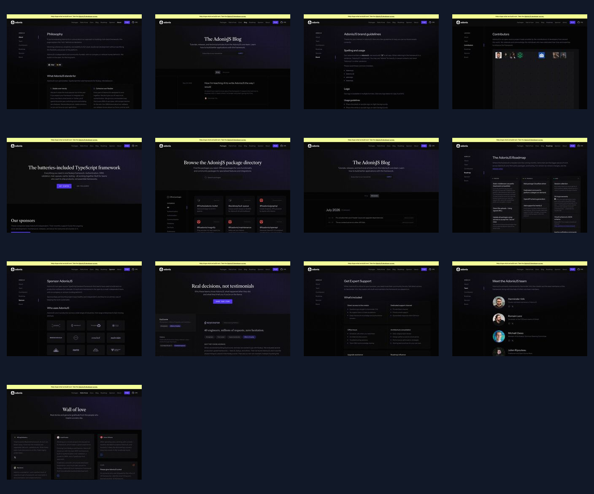
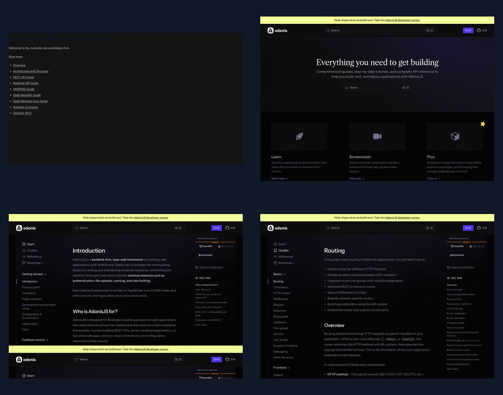

# Auditoria de UX do AdonisJS para a reconstrução do site Jumentix

## Objetivo

Esta auditoria estuda o site público do AdonisJS como referência de produto e frontend para a
reconstrução do site open source do Jumentix. O objetivo é extrair princípios úteis de comunicação
e navegação sem copiar marca, textos, recursos visuais ou código-fonte do AdonisJS.

Data da pesquisa: `2026-07-26`

Governança relacionada:

- Épico: [#167](https://github.com/XpertMinds/Jumentix/issues/167)
- Tarefa: [#168](https://github.com/XpertMinds/Jumentix/issues/168)
- Milestone:
  [Jumentix OSS website rebuild - 2026-08-23](https://github.com/XpertMinds/Jumentix/milestone/3)

## Evidências

A auditoria capturou todas as páginas públicas de primeiro nível expostas pela navegação e pelo
rodapé do AdonisJS, além de páginas representativas da documentação.





Capturas completas:

| Página | Evidência |
| --- | --- |
| Home | [home.jpg](./adonisjs/pages/home.jpg) |
| Pacotes | [packages.jpg](./adonisjs/pages/packages.jpg) |
| Wall of love | [wall-of-love.jpg](./adonisjs/pages/wall-of-love.jpg) |
| Blog | [blog.jpg](./adonisjs/pages/blog.jpg) |
| Roadmap | [roadmap.jpg](./adonisjs/pages/roadmap.jpg) |
| Patrocínio | [sponsor.jpg](./adonisjs/pages/sponsor.jpg) |
| Sobre | [about.jpg](./adonisjs/pages/about.jpg) |
| Histórias | [stories.jpg](./adonisjs/pages/stories.jpg) |
| Releases | [releases.jpg](./adonisjs/pages/releases.jpg) |
| Contribuidores | [contributors.jpg](./adonisjs/pages/contributors.jpg) |
| Suporte | [support.jpg](./adonisjs/pages/support.jpg) |
| Marca | [brand.jpg](./adonisjs/pages/brand.jpg) |
| Time | [team.jpg](./adonisjs/pages/team.jpg) |
| Início da documentação | [docs-home.jpg](./adonisjs/pages/docs-home.jpg) |
| Introdução | [docs-introduction.jpg](./adonisjs/pages/docs-introduction.jpg) |
| Guia de rotas | [docs-routing-guide.jpg](./adonisjs/pages/docs-routing-guide.jpg) |
| Docs atuais do Jumentix | [current-production-docs-jumentix.jpg](./current-production-docs-jumentix.jpg) |

## Mapa da experiência pública

| Superfície | Função de produto | Padrão aplicável ao Jumentix |
| --- | --- | --- |
| Home | Explicar e converter | Categoria clara, prova por código, ecossistema, evidência OSS e próximos passos |
| Pacotes | Expor o ecossistema | Busca, distinção oficial/comunidade e metadados compactos |
| Wall of love | Construir confiança | Prova da comunidade como destino próprio |
| Blog | Manter narrativa ativa | Artigos de release, arquitetura, IA e engenharia |
| Roadmap | Mostrar direção | Estados públicos, links para issues e participação |
| Patrocínio | Explicar sustentabilidade | Propósito, níveis, contrapartidas e patrocinadores |
| Sobre | Declarar filosofia | Problema do ecossistema, decisões e compromisso |
| Histórias | Comprovar decisões | Casos com migração, escala, time e resultados |
| Releases | Demonstrar manutenção | Fluxo cronológico por pacote |
| Contribuidores | Reconhecer a comunidade | Atividade visível e vínculo ao repositório |
| Suporte | Oferecer caminho profissional | Escopo, modelo de resposta e contratação |
| Marca | Permitir reutilização correta | Assets, nomenclatura e exemplos de uso |
| Time | Mostrar manutenção | Responsáveis, papéis e propriedade |
| Início dos docs | Direcionar aprendizado | Busca, caminhos por tarefa, guia e referência |
| Artigo dos docs | Navegar conteúdo denso | Sidebar, artigo, sumário, busca e breadcrumbs |

## Padrões principais

### Separar descoberta de produto e profundidade técnica

O site comercial deve convencer e orientar. A documentação deve permitir execução técnica. Ambos
compartilham marca, busca, GitHub, idioma e ecossistema sem misturar referência com promoção.

### Demonstrar recursos por código real

O Jumentix deve mostrar:

- bootstrap pela CLI;
- controller e handler REST;
- request/response por WebSocket;
- handler gRPC;
- contrato do Message Mediator;
- seleção de driver de banco;
- contratos OpenAPI e AsyncAPI;
- PM2 e configuração de deploy.

### Usar um modelo espacial estável nos docs

A documentação precisa de:

- sidebar persistente no desktop;
- drawer no mobile;
- breadcrumbs;
- sumário lateral;
- anterior/próximo;
- busca global;
- versão e idioma;
- links profundos e código copiável;
- áreas de Guias, Conceitos, Referência, Pacotes e Contribuição.

### Tratar o ecossistema como produto

Pacotes, integrações, releases, contribuidores e roadmap devem ser destinos próprios. O Jumentix
deve tornar visíveis seus adapters HTTP, persistência, realtime, destinos cloud, SDKs, templates e
ferramentas.

### Distinguir níveis de evidência

O site deve diferenciar:

- capacidade implementada e testada;
- integração suportada;
- capacidade no roadmap;
- evidência de segurança e governança;
- evidência de adoção.

## Defeitos confirmados no Jumentix

Rota auditada:
`https://jumentix-website.vercel.app/docs/jumentix`

> Baseline histórico: os defeitos abaixo descrevem a produção observada antes do épico `#167`.
> As tarefas `#170`, `#171` e `#172` substituem esse shell pelo design system compartilhado,
> experiência comercial bilíngue, portal hierárquico de documentação, inventário Storybook e gates
> de rotas e links de produção.

1. A rota exibe MDX puro, sem header, sidebar, sumário, footer ou moldura legível.
2. `app/docs/[[...mdxPath]]/page.tsx` retorna `MDXContent` sem montar o `Layout` do Nextra.
3. `app/layout.tsx` fornece Mantine, mas não monta navegação e footer.
4. O índice usa links relativos e o fallback mistura `/docs/overview` com
   `/docs/jumentix/overview`.
5. A página de overview em produção mostra `Source file not found`.
6. O sync consome arquivos externos ao app, indisponíveis quando a raiz Vercel é o website.
7. O teste prepublish não percorre links, valida landmarks, hidratação ou menu mobile.
8. O teste prepublish invoca `npm`, contrariando o padrão pnpm.
9. Poucos componentes possuem stories.
10. A home atual não funciona como destino completo de framework open source.

```text
Build na Vercel
  -> prebuild do website
  -> sync tenta ler fontes externas ao diretório
  -> fontes ausentes geram "Source file not found"
  -> catch-all importa o MDX
  -> MDX é renderizado sem Layout do Nextra
  -> produção recebe conteúdo cru e navegação frágil
```

A falha é de composição e empacotamento, não apenas de CSS.

## Arquitetura de informação proposta

### Navegação global

1. Produto
   - Visão geral
   - Arquitetura
   - Segurança
   - Changelog
2. Soluções
   - APIs REST
   - APIs realtime
   - SaaS modular
   - Microsserviços
   - SPA/PWA offline
3. Desenvolvedores
   - Documentação
   - Primeiros passos
   - Guias
   - Contratos
   - Pacotes
4. Ecossistema
   - Adapters HTTP
   - Persistência
   - Realtime
   - Cloud e deploy
   - SDKs
5. Comunidade
   - GitHub
   - Roadmap
   - Contribuidores
   - Discussões
   - Marca

Utilitários persistentes:

- busca;
- idioma;
- tema;
- GitHub e stars;
- CTA ou comando de início.

### Rotas públicas

```text
/
├── product
├── architecture
├── security-compliance
├── use-cases
│   ├── rest-api
│   ├── realtime-api
│   ├── spa-pwa
│   ├── saas-monolith
│   └── saas-microservices
├── integrations
├── ecosystem
│   ├── packages
│   ├── http-adapters
│   ├── databases
│   ├── realtime
│   └── deployment
├── changelog
├── roadmap
├── community
│   ├── contributors
│   ├── support
│   └── brand
├── docs
│   ├── getting-started
│   ├── guides
│   ├── concepts
│   ├── reference
│   ├── packages
│   └── contributing
└── pt-BR
    └── rotas públicas e técnicas equivalentes
```

URLs existentes devem permanecer válidas ou receber redirects explícitos.

## Jornadas principais

```text
Product owner:
Home -> Produto -> Caso de uso -> Arquitetura -> Segurança -> CTA

Engenheiro:
Home -> Código -> Primeiros passos -> Guia -> Contrato -> CLI

Plataforma:
Arquitetura -> Ecossistema -> Gates -> Runtime/deploy -> Segurança

Contribuidor:
Comunidade -> Roadmap -> Contribuição -> Issue -> Docs do componente
```

## Inventário para o Storybook

### Shell global

- `AnnouncementBanner`
- `SiteHeader`
- `DesktopNavigation`
- `MobileNavigationDrawer`
- `SiteFooter`
- `ThemeSwitcher`
- `LocaleSwitcher`
- `GitHubLink`
- `SearchTrigger`
- `SearchDialog`

### Comunicação de produto

- `Hero`
- `HeroCodePreview`
- `SectionHeading`
- `FeatureGrid`
- `FeatureCard`
- `CapabilityMatrix`
- `StatsStrip`
- `Metric`
- `ArchitectureFlow`
- `IntegrationGrid`
- `IntegrationBadge`
- `PackageCard`
- `RoadmapCard`
- `ReleaseEntry`
- `Testimonial`
- `CaseStudyCard`
- `CallToActionBand`

### Código e prova técnica

- `CodeBlock`
- `CodeTabs`
- `CodeShowcase`
- `CopyCodeButton`
- `TerminalCommand`
- `FileTree`
- `ContractBadge`
- `DiagramPanel`
- `RequestResponseExample`

### Documentação

- `DocsShell`
- `DocsSidebar`
- `DocsMobileMenu`
- `DocsBreadcrumbs`
- `DocsTableOfContents`
- `DocsPagination`
- `DocsSearchResults`
- `VersionSelector`
- `DocCallout`
- `DocLinkCard`
- `DocCardGrid`
- `TabbedContent`
- `Steps`
- `ApiContractTable`

### Fundações e feedback

- `Button`
- `IconButton`
- `Badge`
- `Card`
- `Tabs`
- `Tooltip`
- `Popover`
- `Pagination`
- `EmptyState`
- `LoadingState`
- `ErrorState`
- `SkipLink`

## Direção visual original

- usar o mascote Jumentix como sinal de marca;
- combinar grafite com lime, cyan, coral e neutros;
- evitar paleta monotônica roxa ou azul-escura;
- usar bordas discretas e raios compactos;
- priorizar código, diagramas, pacotes e evidências;
- reservar tipografia grande para heróis reais;
- manter a documentação quieta e legível;
- respeitar `prefers-reduced-motion`;
- não colocar documentação densa em cards decorativos.

## Limite de não cópia

Não serão reutilizados logos, ícones, ilustrações, textos, depoimentos, código-fonte, CSS,
componentes ou composição idêntica do AdonisJS. As capturas permanecem somente na documentação
interna de pesquisa e não serão assets do site público.

## Mapeamento de entrega

| Achado | Tarefa |
| --- | --- |
| Composição e empacotamento dos docs quebrados | #169 |
| Design system e stories incompletos | #170 |
| Comunicação OSS e prova por código insuficientes | #171 |
| Navegação incapaz de escalar | #172 |
| Gates insuficientes | #173 |
| Deploy exige evidência | #174 |
