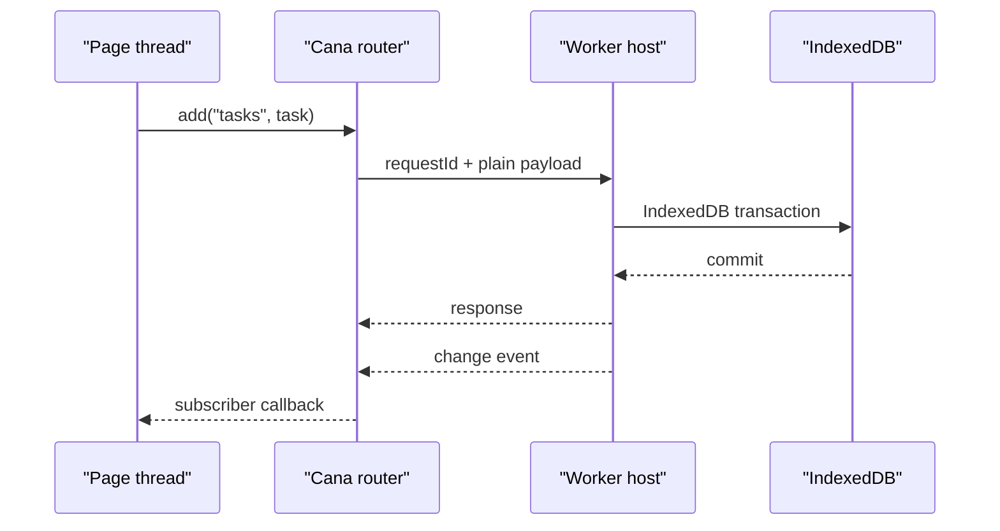

# Workers and testing

Workers move persistence work away from the page thread. The boundary is message
based, so every request and response must be structured-cloneable plain data.

## Worker request flow



## Complete same-thread worker-host demo

This playground uses `MessageChannel` so the docs can run the worker protocol
without creating a separate Worker file. A production app would call
`createWorkerHost()` inside the Worker module and keep `createRouter()` on the
page thread.

<CanaPlayground id="worker-client-flow" />

## Production file layout

`src/cana.worker.ts`

```ts
import { createWorkerHost, type CanaSchema } from '@jumentix/cana';

const schema: CanaSchema = {
  version: 1,
  stores: [
    { name: 'categories', keyPath: 'id', indexes: [{ name: 'byName', keyPath: 'name' }] },
    {
      name: 'tasks',
      keyPath: 'id',
      indexes: [
        { name: 'byCategory', keyPath: 'categoryId' },
        { name: 'byUpdatedAt', keyPath: 'updatedAt' }
      ]
    }
  ]
};

createWorkerHost({
  port: self,
  name: 'tasks-worker-db',
  schema,
  originId: 'tasks-worker',
  retainedEvents: 100,
  operationLedger: true
});
```

`src/cana-client.ts`

```ts
import {
  createRouter,
  createWorkerClient,
  type CanaChangeEvent
} from '@jumentix/cana';

const worker = new Worker(new URL('./cana.worker.ts', import.meta.url), {
  type: 'module'
});

const events: CanaChangeEvent[] = [];
const router = createRouter({
  port: worker,
  timeoutMs: 15_000,
  onBroadcast(event) {
    events.push(event as CanaChangeEvent);
  }
});

export const canaWorker = createWorkerClient(router);
export const canaWorkerEvents = events;

export async function stopCanaWorker() {
  await canaWorker.close();
  router.dispose();
  worker.terminate();
}
```

`src/tasks.ts`

```ts
import { canaWorker } from './cana-client';

export async function createTaskInWorker() {
  await canaWorker.open();
  await canaWorker.put('categories', {
    id: 'work',
    name: 'Work',
    color: '#2563eb',
    createdAt: Date.now(),
    updatedAt: Date.now()
  });
  await canaWorker.add('tasks', {
    id: crypto.randomUUID(),
    title: 'Persist through the worker',
    categoryId: 'work',
    completed: false,
    priority: 'medium',
    createdAt: Date.now(),
    updatedAt: Date.now()
  });
  return canaWorker.query('tasks', { index: 'byCategory', equals: 'work' });
}
```

## Testing strategy

| Layer | What to test | Tooling |
| --- | --- | --- |
| Unit | Schema builders, record mappers, event reducers. | Bun/Jest without a browser. |
| Browser component | React/Vue components update from `CanaChangeEvent`. | Testing Library with injected events. |
| IndexedDB integration | Open, upgrade, query, transaction, fallback, export/import. | Cypress or browser automation. |
| Worker integration | Router timeout, broadcasts, structured-clone failures. | Real Worker in a browser test. |
| Performance | Query ratios, count vs full read, deep pagination. | Browser performance suite. |

## Next

Continue to the [API reference](./CANA-USAGE-API-REFERENCE.md).
