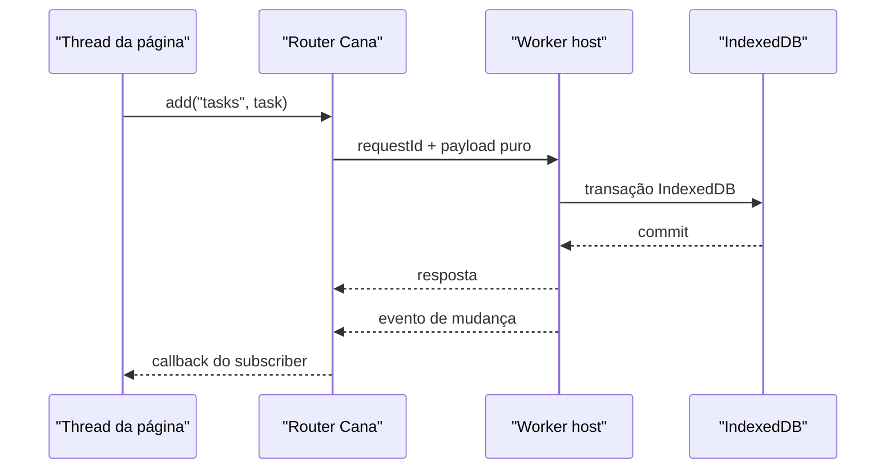

# Workers e testes

Workers movem trabalho de persistência para fora da thread da página. A
fronteira é baseada em mensagens, então toda requisição e resposta precisa ser
dado puro compatível com structured clone.

## Fluxo de requisição do worker



## Demo completa de worker-host na mesma thread

Este playground usa `MessageChannel` para a documentação executar o protocolo
de worker sem criar um arquivo separado de Worker. Em produção, uma app chamaria
`createWorkerHost()` dentro do módulo Worker e manteria `createRouter()` na
thread da página.

<CanaPlayground id="worker-client-flow" />

## Layout de arquivos em produção

`src/cana.worker.ts`

```ts
import { createWorkerHost, type CanaSchema } from '@jumentix/cana';

const schema: CanaSchema = {
  version: 1,
  stores: [
    { name: 'categories', keyPath: 'id', indexes: [{ name: 'byName', keyPath: 'name' }] },
    {
      name: 'tasks',
      keyPath: 'id',
      indexes: [
        { name: 'byCategory', keyPath: 'categoryId' },
        { name: 'byUpdatedAt', keyPath: 'updatedAt' }
      ]
    }
  ]
};

createWorkerHost({
  port: self,
  name: 'tasks-worker-db',
  schema,
  originId: 'tasks-worker',
  retainedEvents: 100,
  operationLedger: true
});
```

`src/cana-client.ts`

```ts
import {
  createRouter,
  createWorkerClient,
  type CanaChangeEvent
} from '@jumentix/cana';

const worker = new Worker(new URL('./cana.worker.ts', import.meta.url), {
  type: 'module'
});

const events: CanaChangeEvent[] = [];
const router = createRouter({
  port: worker,
  timeoutMs: 15_000,
  onBroadcast(event) {
    events.push(event as CanaChangeEvent);
  }
});

export const canaWorker = createWorkerClient(router);
export const canaWorkerEvents = events;

export async function stopCanaWorker() {
  await canaWorker.close();
  router.dispose();
  worker.terminate();
}
```

`src/tasks.ts`

```ts
import { canaWorker } from './cana-client';

export async function createTaskInWorker() {
  await canaWorker.open();
  await canaWorker.put('categories', {
    id: 'work',
    name: 'Work',
    color: '#2563eb',
    createdAt: Date.now(),
    updatedAt: Date.now()
  });
  await canaWorker.add('tasks', {
    id: crypto.randomUUID(),
    title: 'Persist through the worker',
    categoryId: 'work',
    completed: false,
    priority: 'medium',
    createdAt: Date.now(),
    updatedAt: Date.now()
  });
  return canaWorker.query('tasks', { index: 'byCategory', equals: 'work' });
}
```

## Estratégia de testes

| Camada | O que testar | Ferramenta |
| --- | --- | --- |
| Unit | Builders de schema, mappers de registro, reducers de evento. | Bun/Jest sem navegador. |
| Componente no browser | Componentes React/Vue atualizam a partir de `CanaChangeEvent`. | Testing Library com eventos injetados. |
| Integração IndexedDB | Open, upgrade, query, transaction, avaliação de storage, export/import. | Cypress ou automação de browser. |
| Integração de worker | Timeout do router, broadcasts, falhas de structured clone. | Worker real em teste de browser. |
| Performance | Proporções de query, count vs leitura completa, paginação profunda. | Suíte de performance no browser. |

## Próximo

Continue na [referência de API](./CANA-USAGE-API-REFERENCE.pt-BR.md).
