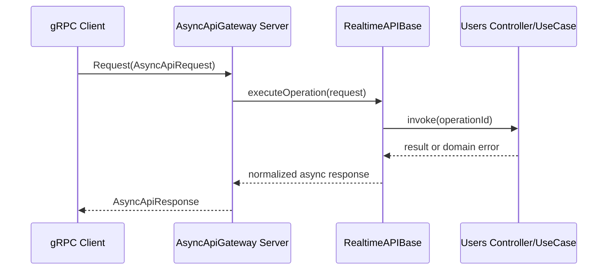

<!--
Arquivo gerado automaticamente a partir de: documentation/md/adapters/realtime/GRPC-API.md
Idioma alvo: Português (Brasil)
-->
#API gRPC em tempo real

Este guia é exclusivo para a interface em tempo real do gRPC.

## Escopo

- Transporte: gRPC
- Implementação do servidor: `apps/backend-template/src/interface/gRPC/gRPCAPI.ts`
- Contrato proto: `apps/backend-template/src/interface/gRPC/proto/async-api.proto`
- Cliente SDK: `sdk-clients/grpc/GrpcApiClient.ts`
- Fonte AsyncAPI: `spec/asyncapi/1.0.0.grpc.yml`

## Referências de contrato

- [Contratos em tempo real gRPC](../../contracts/GRPC-REALTIME-CONTRACTS.md)
- [Contratos e respostas de erro](../../ERROR-CONTRACTS-AND-RESPONSES.md)
- [Mapa de eventos e mensagens](../../EVENTS-AND-MESSAGES-MAP.md)

## Contrato de serviço

- Nome do serviço: `realtime.AsyncApiGateway`
- Métodos RPC:
  - `Request(AsyncApiRequest) retorna (AsyncApiResponse)` (unário)
  - `Exchange(stream AsyncApiRequest) retorna (stream AsyncApiResponse)` (stream bidirecional)

## Fluxo de tempo de execução



## Exemplo profundo: solicitação unária

```ts
import { GrpcApiClient } from '../sdk-clients/grpc/GrpcApiClient';

const client = new GrpcApiClient('localhost:3002');

const response = await client.request({
  version: '1.0.0',
  operationId: 'createOrganization',
  authorization: 'Bearer <jwt>',
  input: {
    name: 'Acme Group',
    address: [],
    phone: [],
    email: []
  },
  metadata: {
    requestId: 'req-grpc-001',
    correlationId: 'corr-tenant-42'
  }
});

if (!response.ok) {
  console.error(response.error);
} else {
  console.log(response.result);
}
```

## Exemplo profundo: fluxo bidirecional gRPC nativo

```ts
import path from 'path';
import grpc from '@grpc/grpc-js';
import protoLoader from '@grpc/proto-loader';

const protoPath = path.resolve(process.cwd(), 'src/interface/gRPC/proto/async-api.proto');
const packageDefinition = protoLoader.loadSync(protoPath, {
  longs: String,
  enums: String,
  defaults: true,
  oneofs: true
});
const grpcObject = grpc.loadPackageDefinition(packageDefinition) as any;
const client = new grpcObject.realtime.AsyncApiGateway(
  'localhost:3002',
  grpc.credentials.createInsecure()
);

const stream = client.exchange();

stream.on('data', (msg: any) => {
  const result = msg.resultJson ? JSON.parse(msg.resultJson) : null;
  console.log('stream response', msg.operationId, result, msg.errorMessage);
});

stream.on('error', (err: Error) => {
  console.error('stream error', err);
});

stream.write({
  version: '1.0.0',
  operationId: 'getAllOrganizations',
  authorization: 'Bearer <jwt>',
  inputJson: JSON.stringify({}),
  paramsJson: JSON.stringify({}),
  queryStringJson: JSON.stringify({ page: 1, size: 20 }),
  metadataJson: JSON.stringify({ requestId: 'stream-1' })
});

stream.end();
```

## Regras de serialização de carga útil

1. Os campos de transporte `inputJson`, `paramsJson`, `queryStringJson`, `metadataJson` são strings JSON.
2. O servidor mapeia a carga útil de transporte para o envelope de solicitação assíncrona interna.
3. `resultJson` em resposta deve ser analisado pelos consumidores clientes.
4. `errorName` e `errorMessage` fornecem metadados de falha normalizados.

## Orientação Operacional

1. Mantenha um cliente por host/porta de serviço para reutilização da conexão.
2. Prefira RPC unário para operações independentes.
3. Use troca de fluxo para lotes de operação de alta frequência.
4. Aplique correlação por solicitação com `metadataJson.requestId`.
