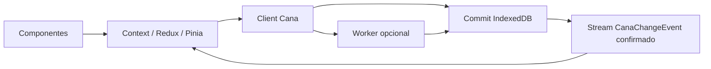
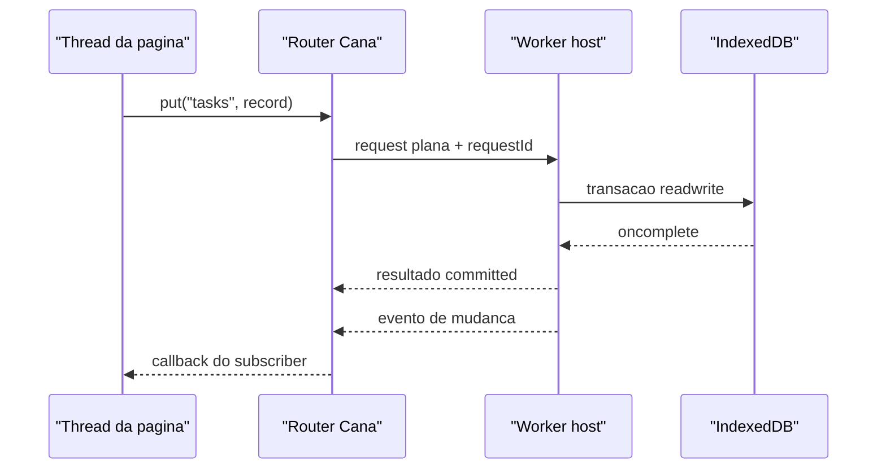

# @jumentix/cana

Adaptador de banco de dados offline sobre IndexedDB para aplicações Jumentix.

```ts
import { createClient } from '@jumentix/cana';

const client = createClient({
  name: 'tasks-app',
  schema: {
    version: 1,
    stores: [
      { name: 'categories', keyPath: 'id', indexes: [{ name: 'byName', keyPath: 'name' }] },
      {
        name: 'tasks',
        keyPath: 'id',
        indexes: [
          { name: 'byCategory', keyPath: 'categoryId' },
          { name: 'byUpdatedAt', keyPath: 'updatedAt' }
        ]
      }
    ]
  }
});

await client.open();
await client.table('categories').put({ id: 'work', name: 'Work' });
await client.table('tasks').add({
  id: 'task-1',
  title: 'Write the Cana tutorial',
  categoryId: 'work',
  completed: false,
  updatedAt: Date.now()
});
```

## Responsabilidade no escopo

- **Camada:** persistência offline / browser
- **Responsável por:** API de cliente IndexedDB (com fallback explícito localStorage) para PWAs
- **Usado com:** `@jumentix/cana-react`, `@jumentix/cana-vue`, designer-core, guia SPA/PWA, service-management
- **Não responsável por:** bancos server-side, Redis KV, REST/WebSocket

## Três coisas a saber antes de usar

**IndexedDB preferido; fallback em localStorage é explícito e degradado.** Depois
de `open()`, leia `client.backend`: `'indexeddb'` ou `'localStorage'`. Quando o
IndexedDB não abre, o Cana abre por padrão um store em localStorage
(`fallback: 'localStorage'`). Esse caminho tem cota menor e sem índices reais —
a avaliação de durabilidade reporta `best-effort`. Passe `fallback: false` para
voltar ao `Unavailable` terminal. Não há dual-write nem auto-promote entre os
dois stores; use `exportAll()` / import para mover dados.

**Escritas têm três desfechos, não dois.** `committed | rolled-back | unknown`.
O terceiro cobre uma transação derrubada sem que nenhum dos dois eventos
dispare — um worker morto, uma aba fechada. Ative `operationLedger: true` e
`resolveWrite()` responderá de forma definitiva, porque o id da operação é
gravado dentro da mesma transação que os dados.

**Nunca dê `await` em algo que não seja uma requisição do IndexedDB dentro de
uma transação.** A transação faz auto-commit assim que o event loop cede sem
requisições pendentes, então `await fetch(...)` não pausa a transação — ele a
encerra. O Cana reporta a violação como `TransactionInactive` em vez de deixar
uma `DOMException` crua escapar.

## Erros são dados puros

`CanaError` não é uma subclasse de `Error`, porque o structured clone não
preserva identidade de classe ao atravessar o armazenamento ou a fronteira de um
worker — uma verificação `instanceof` passaria a retornar `false` sem avisar.
Use os guards:

```ts
import { isCanaError, isCanaErrorCode } from '@jumentix/cana';

if (isCanaErrorCode(error, 'QuotaExceeded')) { /* ... */ }
```

## Experimente no navegador

Execute um primeiro client contra IndexedDB nesta página:

<CanaPlayground id="getting-started" />

## Design notes

O Cana é intencionalmente mais próximo de um pequeno motor de banco de dados no
navegador do que de uma store de estado de frontend. O IndexedDB é responsável
pelo armazenamento durável; o Cana adiciona a superfície de cliente, desfechos
explícitos de transação, replay de mudanças, reconciliação após falha e uma
fronteira opcional de worker para aplicações que precisam tirar persistência da
thread de UI.


### Modelo mental em 30 segundos



Leia o diagrama da esquerda para a direita quando o usuário age, e da direita
para a esquerda quando a escrita faz commit:

1. Componentes chamam uma action do framework.
2. A action escreve em `categories` ou `tasks` pelo Cana.
3. IndexedDB confirma ou reverte de forma atômica.
4. Cana emite um evento confirmado.
5. Context, Redux ou Pinia atualiza o estado renderizado a partir desse evento.

### Arquitetura no estilo Postgres

A analogia é limitada, mas útil. O PostgreSQL registra mudanças com
[write-ahead logging](https://www.postgresql.org/docs/current/wal-intro.html),
separa trabalho de primeiro plano de manutenção com processos como o
[background writer](https://www.postgresql.org/docs/current/runtime-config-resource.html)
e permite que extensões executem
[background workers](https://www.postgresql.org/docs/current/bgworker.html). O
Cana mapeia essas ideias para primitivas do navegador em vez de entregar um
servidor:

- **Camada de armazenamento:** IndexedDB é a camada durável de stores/páginas e
  é quem controla commit e rollback atômicos. O fallback em localStorage é
  explícito e degradado.
- **Fronteira de commit:** uma transação Cana é a unidade de durabilidade. Os
  eventos de mudança ficam em buffer durante o corpo e só são liberados após
  `oncomplete` do IndexedDB, então subscribers nunca reagem a escritas que
  depois sofrem rollback.
- **Stream lógico de mudanças:** subscribers recebem `CanaChangeEvent`
  confirmados, com cursores monotônicos. `sinceCursor` consegue fazer replay de
  uma janela retida e limitada; se o cursor pedido ficou antigo demais, o Cana
  informa que a UI precisa ressincronizar em vez de fingir que o replay foi
  completo.
- **Reconciliação de crash:** `operationLedger: true` grava um registro de
  operação na mesma transação dos dados. Depois de um worker morto, aba fechada
  ou resposta perdida, `resolveWrite()` consegue distinguir `committed`,
  `rolled-back` e `unresolvable`.
- **Fronteira com state management:** Cana não substitui React Context, Redux,
  Pinia, Zustand ou outra store de UI. O formato recomendado é tratar o Cana
  como fonte durável da verdade, ouvir os eventos do Cana e atualizar a store do
  framework a partir desses eventos já commitados.

### Modelo de workers

`createWorkerHost()` executa um client Cana real atrás de um `MessagePort` ou de
um `Worker` dedicado. `createRouter()` e `createWorkerClient()` ficam no lado da
página e transformam chamadas tipadas em mensagens de dados puros.

- As mensagens carregam apenas dados compatíveis com structured clone: funções,
  objetos DOM, instâncias de `IDBRequest`, instâncias de classe e subclasses de
  `Error` não atravessam a fronteira.
- Toda requisição carrega um `requestId`, porque um worker pode responder
  requisições concorrentes fora de ordem.
- O timeout padrão de requisição é de 15 segundos. Leituras que expiram reportam
  `Unavailable`; escritas que expiram reportam `UnknownOutcome`, porque o worker
  pode ter commitado antes de morrer ou antes de postar a resposta.
- O host transmite mudanças commitadas como `{ kind: 'change', event }`, que é o
  gancho usado nos tutoriais de React Context, Redux e Pinia para atualizar o
  estado dos componentes.
- Corpos de `transaction()` com múltiplas operações não atravessam a fronteira
  do worker porque o corpo é uma função. Execute essa transação dentro do
  worker, ou envie escritas individuais pelo `createWorkerClient()`.



### Dados de performance

A suíte de performance do Cana no navegador roda contra IndexedDB real em disco
e usa asserções de proporção em vez de promessas absolutas de milissegundos.
Isso mantém os dados portáveis entre browsers, discos e runners compartilhados.
As proporções ainda protegem o ponto importante: quanto trabalho o Cana pede
para o navegador executar.


#### Modelo algorítmico

| Caminho | Forma algorítmica | O que a implementação evita |
| --- | --- | --- |
| Query limitada | `O(limit)` depois que o cursor abre. | Ler a store inteira e cortar o array em JavaScript. |
| Busca indexada | Modelo comum de índice do IndexedDB: `O(log n + matches)`. | Anunciar um índice no `explain()` enquanto ainda faz full scan. |
| `get()` por chave primária | Modelo comum de busca por chave no IndexedDB: `O(log n)`. | Varrer linhas para encontrar uma chave conhecida. |
| `count()` nativo | Uma requisição nativa `count()` do IndexedDB; o Cana não materializa linhas em JavaScript. O custo interno do browser depende da implementação. | Contar lendo todos os registros. |
| `bulkAdd()` | `O(n)` escritas em uma transação IndexedDB. | Disparar um fan-out grande e desordenado de promises que perde a ordem de entrada e a posição de falha parcial. |
| Paginação profunda | `O(offset + limit)` de movimento de cursor, com clone para JavaScript só dos registros retornados. | Ler milhares de registros em um array antes de aplicar `offset`. |

#### Referência medida

Estes números são uma amostra local de referência, não um SLA de latência. Eles
foram medidos em 2026-08-12 com Headless Chrome 151 no macOS, usando o bundle
ESM publicado do Cana, o mesmo schema de `packages/cana/cypress/performance.cy.ts`,
cinco execuções de leitura por operação e três execuções de `bulkAdd()`. O valor
mostrado é a mediana.

| Operação | Registros na store | Query / tamanho do resultado | Complexidade usada no exemplo | Mediana local |
| --- | ---: | --- | --- | ---: |
| `bulkAdd()` | 10.000 | escreve 10.000 linhas | `O(n)` | 1.117,5 ms |
| Query limitada | 1.000 | `limit: 10`, retorna 10 linhas | `O(limit)` | 0,4 ms |
| Query limitada | 10.000 | `limit: 10`, retorna 10 linhas | `O(limit)` | 0,5 ms |
| Busca indexada | 1.000 | 100 grupos, `equals: 'g7'`, retorna 10 linhas | `O(log n + matches)` | 0,5 ms |
| Busca indexada | 10.000 | 100 grupos, `equals: 'g7'`, retorna 100 linhas | `O(log n + matches)` | 1,4 ms |
| `get()` por chave primária | 1.000 | chave `500` | `O(log n)` | 0,2 ms |
| `get()` por chave primária | 10.000 | chave `500` | `O(log n)` | 0,2 ms |
| `count()` nativo | 10.000 | conta todas as linhas sem retorná-las | uma requisição nativa; sem materialização em JS | 3,2 ms |
| Query completa | 10.000 | retorna as 10.000 linhas | `O(n)` | 55,2 ms |
| Página inicial | 10.000 | `offset: 10`, `limit: 20`, retorna 20 linhas | `O(offset + limit)` | 0,5 ms |
| Página profunda | 10.000 | `offset: 9000`, `limit: 20`, retorna 20 linhas | `O(offset + limit)` com avanço de cursor | 13,8 ms |

#### Guardrails da CI

Os testes automatizados de performance mantêm estes contratos verdes:

- Uma query com `limit: 10` em 10.000 linhas fica quase constante em relação a
  1.000 linhas: no máximo `max(4x a mediana de 1.000 linhas, 5ms)`.
- Uma busca indexada em 10.000 linhas fica abaixo de
  `max(25x a mediana de 1.000 linhas, 20ms)`, mesmo com o resultado crescendo de
  10 para 100 linhas.
- `count()` em 10.000 linhas fica mais rápido do que uma query completa que
  retorna todas as linhas.
- Um `get()` por chave primária em 10.000 linhas fica quase constante em relação
  a 1.000 linhas: no máximo `max(4x a mediana de 1.000 linhas, 5ms)`.
- `bulkAdd()` commita todas as 10.000 linhas em uma transação e reporta
  exatamente 10.000 chaves.
- Paginação profunda em `offset: 9000`, `limit: 20` fica abaixo de
  `max(60x a mediana de uma página inicial, 60ms)`, provando avanço de cursor em
  vez de materializar as linhas puladas.

## Checklist júnior (“Eu consigo …”)

- [ ] Abrir um client, adicionar uma linha e lê-la de volta.
- [ ] Conferir `client.backend` após `open()` e explicar indexeddb vs localStorage.
- [ ] Evitar `TransactionInactive` mantendo `await`s externos fora de transações.

## Tutoriais por framework

Construa o mesmo app de tarefas categorizadas com state management de frontend:

- [React Context API](/docs/pt-BR/jumentix/packages/cana/react-context)
- [React Redux](/docs/pt-BR/jumentix/packages/cana/react-redux)
- [Vue 3 e Pinia](/docs/pt-BR/jumentix/packages/cana/vue-pinia)

Use os pacotes pequenos de integração nas aplicações:

```bash
bun add @jumentix/cana @jumentix/cana-react
bun add @jumentix/cana @jumentix/cana-vue
```

## Próximo passo

Continue no [guia de uso](../../documentation/md/CANA-USAGE-GUIDE.pt-BR.md) do
consumidor — API completa, consultas, transações, hooks, recuperação de falhas e
solução de problemas. Use
[designer-core](/docs/pt-BR/jumentix/packages/designer-core/usage) quando uma
UI Jumentix também precisar validar documentos de domínio antes de persistir.
