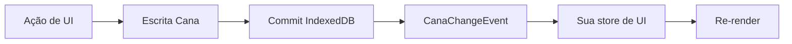

# Integrar o Cana com qualquer framework de UI

`@jumentix/cana` é um cliente de persistência no browser. Ele não controla o
estado de renderização. Todo framework de UI — ou nenhum — segue o mesmo
contrato.

## Contrato estável

```ts
import { createClient, isCanaErrorCode, type CanaChangeEvent } from '@jumentix/cana';

const client = createClient({
  name: 'tasks-app',
  schema: { /* stores versionadas */ },
  originId: 'ui-main'
});

await client.open();

// Escritas
await client.table('tasks').add({ /* registro */ });
await client.transaction('readwrite', ['categories', 'tasks'], async (tx) => {
  // Só awaits de Cana/IndexedDB dentro deste callback
});

// Leituras após o commit
client.subscribe((event: CanaChangeEvent) => {
  // Atualize sua store de UI a partir dos eventos commitados
});
```

Essa é toda a superfície de integração:

| Passo | API Cana | Seu trabalho |
| --- | --- | --- |
| 1. Criar | `createClient({ name, schema, originId? })` | Escolher nome do DB e schema uma vez |
| 2. Abrir | `await client.open()` | Chamar antes de qualquer acesso a tabela |
| 3. Escrever | `table().add/put/update/delete` ou `transaction()` | Chamar a partir das ações de UI |
| 4. Commit | IndexedDB `oncomplete` | O Cana bufferiza eventos até o commit |
| 5. Sincronizar UI | `client.subscribe(...)` | Mapear `CanaChangeEvent` para sua store |



## Regras que não mudam entre frameworks

1. **Nunca faça `await` de trabalho que não seja IndexedDB dentro de uma
   transação.** `await fetch(...)`, timers ou promises sem relação encerram a
   transação. O Cana reporta `TransactionInactive`.
2. **Escritas têm três resultados:** `committed | rolled-back | unknown`. Ative
   `operationLedger: true` e use `resolveWrite()` quando precisar fechar um
   `unknown` após um crash.
3. **Erros são dados puros.** Use `isCanaError()` / `isCanaErrorCode()` — não
   `instanceof`.
4. **`originId` filtra o eco das suas próprias escritas** quando você também
   aplica patches otimistas de UI antes do evento de commit.
5. **`sinceCursor` retoma listeners após reload.** Se o replay falhar com
   `NotFound`, recarregue as tabelas e reinscreva.

## Wiring manual vs pacotes helper

| Situação | Use |
| --- | --- |
| Vanilla JS/TS, Svelte, Solid, Angular, store custom | `subscribe` manual → patch de estado (este guia + [Vanilla TypeScript](./vanilla-typescript.md)) |
| React com Context | Opcional [`@jumentix/cana-react`](/docs/pt-BR/jumentix/packages/cana-react) ou Context manual ([tutorial](/docs/pt-BR/jumentix/packages/cana/react-context)) |
| React com Redux | Opcional `connectCanaToRedux` de `@jumentix/cana-react/redux` ([tutorial](/docs/pt-BR/jumentix/packages/cana/react-redux)) |
| Vue 3 com Pinia | Opcional [`@jumentix/cana-vue`](/docs/pt-BR/jumentix/packages/cana-vue) ([tutorial](/docs/pt-BR/jumentix/packages/cana/vue-pinia)) |

Os pacotes helper só traduzem eventos commitados em estado de framework. Eles
não substituem `createClient`, o desenho de schema ou a disciplina de
transação.

## Adaptador mínimo de subscribe

Copie este padrão para qualquer store. Troque `applyEvent` pela API de update
do seu framework (`setState`, `dispatch`, `store.$patch`, um `Map`, etc.).

```ts
import type { CanaChangeEvent, CanaClient } from '@jumentix/cana';

export function connectCanaToUi(
  client: CanaClient,
  applyEvent: (event: CanaChangeEvent) => void
): () => void {
  return client.subscribe((event) => {
    if (event.originId === client.originId) {
      // Opcional: ignore se você já aplicou um patch otimista
    }
    applyEvent(event);
  });
}
```

Mapeie os tipos de evento de forma consistente:

| `event.type` | Patch típico de UI |
| --- | --- |
| `created` / `updated` | Upsert do registro pela chave |
| `deleted` | Remover registro pela chave |
| `cleared` | Esvaziar a coleção em memória daquela store |

## Checklist para um framework novo

- [ ] `open()` roda uma vez no boot (ou entrada da rota) antes das chamadas de tabela.
- [ ] Ações de UI escrevem pelo Cana; não mutam o estado durável sozinhas.
- [ ] Um único subscriber (ou helper) atualiza a UI a partir de eventos commitados.
- [ ] Escritas multi-store usam `transaction('readwrite', [...], ...)`.
- [ ] Unsubscribe no tear-down (unmount, saída de rota, dispose do app).
- [ ] Existe caminho de replay/reload para falhas de `sinceCursor`.

## Próximo

- [Tutorial Vanilla TypeScript](./vanilla-typescript.md) — app de tarefas completo sem framework.
- [Primeiros passos](./getting-started.md) — schema e primeiras escritas.
- [Transações e eventos de mudança](./transactions-events.md) — escritas atômicas e replay.
